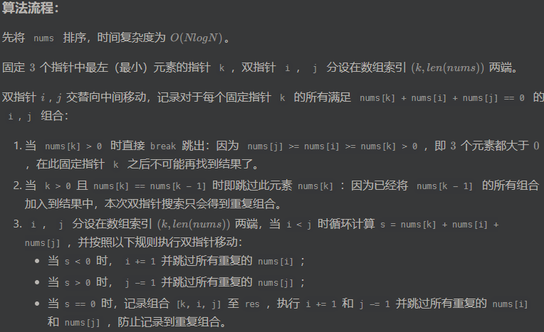

# letcode刷题(1_100)

## 1 两数之和

```
数组、哈希表
```

题解：
- step1：用一个哈希表，存储遍历过的元素以及下标
- step2：遍历元素时，判断 target - cur_element 是否在 hashmap 里，在则放回相应的下标，不在存储遍历过的元素以及下标，继续往下遍历

Python:
```python
class Solution:
    def twoSum(self, nums: List[int], target: int) -> List[int]:
        idx = {}
        for j, x in enumerate(nums):
            if target - x in idx:
                return [idx[target - x], j]
            idx[x] = j
```

Rust:
```rust
use std::collections::HashMap;

impl Solution {
    pub fn two_sum(nums: Vec<i32>, target: i32) -> Vec<i32> {
        let mut idx = HashMap::new();

        for (index, &num) in nums.iter().enumerate() {
            if let Some(&i) = idx.get(&(target - num)) {
                return vec![i as i32, index as i32];
            }
            idx.insert(num, index);
        }

        unreachable!()
    }
}
```

## 2. 两个数相加:

```
递归、链表、数学
```

Python:
```python
# Definition for singly-linked list.
# class ListNode:
#     def __init__(self, val=0, next=None):
#         self.val = val
#         self.next = next
class Solution:
    def addTwoNumbers(self, l1: Optional[ListNode], l2: Optional[ListNode]) -> Optional[ListNode]:
        cur = dummy = ListNode()  # 哨兵模式
        carry = 0  # 进位
        while l1 or l2 or carry:
            s = carry + (l1.val if l1 else 0) + (l2.val if l2 else 0)  # 位数之和
            cur.next = ListNode(s % 10)  # 计算当前位
            carry = s // 10  # 计算进位
            cur = cur.next
            if l1: l1 = l1.next
            if l2: l2 = l2.next
        return dummy.next
```

Rust
```rust
// Definition for singly-linked list.
// #[derive(PartialEq, Eq, Clone, Debug)]
// pub struct ListNode {
//   pub val: i32,
//   pub next: Option<Box<ListNode>>
// }
//
// impl ListNode {
//   #[inline]
//   fn new(val: i32) -> Self {
//     ListNode {
//       next: None,
//       val
//     }
//   }
// }
impl Solution {
    pub fn add_two_numbers(l1: Option<Box<ListNode>>, l2: Option<Box<ListNode>>) -> Option<Box<ListNode>> {
        let mut l1 = l1; // 移动所有权
        let mut l2 = l2; // 移动所有权

        let mut dummy = ListNode::new(0); // 哨兵节点
        let mut cur = &mut dummy;
        let mut carry = 0; // 进位
        while l1.is_some() || l2.is_some() || carry != 0 {
            let mut sum = carry;
            if let Some(node) = l1 {
                sum += node.val;
                l1 = node.next;
            }

            if let Some(node) = l2 {
                sum += node.val;
                l2 = node.next;
            }
            
            carry = sum / 10;
            cur.next = Some(Box::new(ListNode::new(sum % 10)));
            cur = cur.next.as_mut().unwrap();
        }
        dummy.next
    }
}
```

## 3. 无重复字符的最长子串

```
哈希表、字符串、滑动窗口
```

题解：


Python:
```python
class Solution:
    def lengthOfLongestSubstring(self, s: str) -> int:
        # 哈希集合，记录每个字符是否出现过
        occ = set()
        n = len(s)
        # 右指针，初始值为 -1，相当于我们在字符串的左边界的左侧，还没有开始移动
        rk, ans = -1, 0
        for i in range(n):
            if i != 0:
                # 左指针向右移动一格，移除一个字符
                occ.remove(s[i - 1])
            while rk + 1 < n and s[rk + 1] not in occ:
                # 不断地移动右指针
                occ.add(s[rk + 1])
                rk += 1
            # 第 i 到 rk 个字符是一个极长的无重复字符子串
            ans = max(ans, rk - i + 1)
        return ans
```

Rust:
```rust
use std::collections::HashSet;

impl Solution {
    pub fn length_of_longest_substring(s: String) -> i32 {
        let s = s.as_bytes();
        let mut ans = 0;
        let mut left = 0;
        let mut window = [false; 128];
        for (right, &c) in s.iter().enumerate() {
            let c = c as usize;
            // 如果窗口内已经包含 c，那么再加入一个 c 会导致窗口内有重复元素
            // 所以要在加入 c 之前，先移出窗口内的 c
            while window[c] { // 窗口内有字符c
                window[s[left] as usize] = false; // 移除
                left += 1;
            }

            window[c] = true;
            ans = ans.max(right - left + 1); // 更新窗口长度最大值
        }
        ans as _
    }
}
```

## 4 寻找两个正序数组的中位数

```
数组、二分查找、分治
```

Python:
```python
class Solution:
    def findMedianSortedArrays(self, nums1: List[int], nums2: List[int]) -> float:
        def getKthElement(k):
            """
            - 主要思路：要找到第 k (k>1) 小的元素，那么就取 pivot1 = nums1[k/2-1] 和 pivot2 = nums2[k/2-1] 进行比较
            - 这里的 "/" 表示整除
            - nums1 中小于等于 pivot1 的元素有 nums1[0 .. k/2-2] 共计 k/2-1 个
            - nums2 中小于等于 pivot2 的元素有 nums2[0 .. k/2-2] 共计 k/2-1 个
            - 取 pivot = min(pivot1, pivot2)，两个数组中小于等于 pivot 的元素共计不会超过 (k/2-1) + (k/2-1) <= k-2 个
            - 这样 pivot 本身最大也只能是第 k-1 小的元素
            - 如果 pivot = pivot1，那么 nums1[0 .. k/2-1] 都不可能是第 k 小的元素。把这些元素全部 "删除"，剩下的作为新的 nums1 数组
            - 如果 pivot = pivot2，那么 nums2[0 .. k/2-1] 都不可能是第 k 小的元素。把这些元素全部 "删除"，剩下的作为新的 nums2 数组
            - 由于我们 "删除" 了一些元素（这些元素都比第 k 小的元素要小），因此需要修改 k 的值，减去删除的数的个数
            """
            
            index1, index2 = 0, 0
            while True:
                # 特殊情况
                if index1 == m:
                    return nums2[index2 + k - 1]
                if index2 == n:
                    return nums1[index1 + k - 1]
                if k == 1:
                    return min(nums1[index1], nums2[index2])

                # 正常情况
                newIndex1 = min(index1 + k // 2 - 1, m - 1)
                newIndex2 = min(index2 + k // 2 - 1, n - 1)
                pivot1, pivot2 = nums1[newIndex1], nums2[newIndex2]
                if pivot1 <= pivot2:
                    k -= newIndex1 - index1 + 1  # 更新k值
                    index1 = newIndex1 + 1  # 更新下标值
                else:
                    k -= newIndex2 - index2 + 1  # 更新k值
                    index2 = newIndex2 + 1  # 更新下班值

  
        m, n = len(nums1), len(nums2)
        totalLength = m + n
        if totalLength % 2 == 1:
            return getKthElement((totalLength + 1) // 2)
        else:
            return (getKthElement(totalLength // 2) + getKthElement(totalLength // 2 + 1)) / 2
```

Rust:
```rust
pub fn get_kth_element(nums1: &Vec<i32>, nums2: &Vec<i32>, k: usize) -> i32 {
        let (mut index1, mut index2) = (0, 0);
        let mut k = k;
    loop {
        // 特殊情况
        if index1 == nums1.len() {
            return nums2[index2 + k - 1];
        }
        if index2 == nums2.len() {
            return nums1[index1 + k - 1];
        }
        if k == 1 {
            return nums1[index1].min(nums2[index2]);
        }
        // 正常情况
        let new_index1 = (index1 + k / 2 - 1).min(nums1.len() - 1);
        let new_index2 = (index2 + k / 2 - 1).min(nums2.len() - 1);
        let pivot1 = nums1[new_index1];
        let pivot2 = nums2[new_index2];
        if pivot1 <= pivot2 {
            k -= new_index1 - index1 + 1; // 更新k值
            index1 = new_index1 + 1; // 更新下标值
        } else {
            k -= new_index2 - index2 + 1; // 更新k值
            index2 = new_index2 + 1; // 更新下标值
        }
    }
}

impl Solution {
    pub fn find_median_sorted_arrays(nums1: Vec<i32>, nums2: Vec<i32>) -> f64 {
        let m = nums1.len();
        let n = nums2.len();
        let total_length = m + n;

        if total_length % 2 == 1 {
            get_kth_element(&nums1, &nums2, (total_length + 1) / 2) as f64
        } else {
            (get_kth_element(&nums1, &nums2, total_length / 2) + get_kth_element(&nums1, &nums2, total_length / 2 + 1)) as f64 / 2.0
        }
    }
}
```

## 5. 最长回文字符串

```
双指针、字符串、动态规划
```

题解：


Python
```python
class Solution:
    def longestPalindrome(self, s: str) -> str:
        n = len(s)
        if n < 2:
            return s
        
        max_len = 1;
        begin = 0;
        dp = [[False] * n for _ in range(n)]  # dp[i][j] 表示 s[i..j] 是否是回文串
        for i in range(n):
            dp[i][i] = True

        # 递推开始
        # 先枚举子串长度
        for L in range(2, n + 1):
            # 枚举左边界，左边界的上限设置可以宽松一些
            for i in range(n):
                # 由 L 和 i 可以确定右边界，即 j - i + 1 = L 得
                j = L + i - 1
                if j >= n:
                    break

                if s[i] != s[j]:
                    dp[i][j] = False
                else:
                    if j - i < 3:
                        dp[i][j] = True
                    else:
                        dp[i][j] = dp[i+1][j - 1]
                
                if dp[i][j] and j - i + 1 > max_len:
                    max_len = j - i + 1
                    begin = i
        
        return s[begin:begin + max_len]
```

Rust:
```rust
impl Solution {
    pub fn longest_palindrome(s: String) -> String {
        let (mut start, mut end) = (0, 0);
        let s = s.chars().collect::<Vec<_>>();
        let mut dp = vec![vec![false; s.len()]; s.len()];
        for i in (0..s.len()).rev() {
            for j in i..s.len() {
                if i == j || j - i == 1 && s[i] == s[j] {
                    dp[i][j] = true;
                } else {
                    dp[i][j] = dp[i + 1][j - 1] && s[i] == s[j];
                }
                
                if dp[i][j] && j - i > end - start {
                    start = i;
                    end = j;
                }
            }
        }
        s[start..=end].iter().collect()
    }
}
```

## 6. z字形变换

```
字符串
```

Python:
```Python
class Solution:
    def convert(self, s: str, numRows: int) -> str:
        if numRows < 2: return s
        res = ["" for _ in range(numRows)]
        i, flag = 0, -1
        for c in s:
            res[i] += c
            # 到转折点取反
            if i == 0 or i == numRows - 1:
                flag = -flag
            i += flag  # 遍历行索引
        return "".join(res)
```

Rust:
```Rust
impl Solution {
    pub fn convert(s: String, num_rows: i32) -> String {
        if (num_rows < 2) {
            return s;
        }
        let mut res = vec![String::new(); num_rows as usize];
        let mut i = 0;
        let mut flag = -1;

        for c in s.chars() {
            res[i as usize].push(c);
            if i == 0 || i == num_rows - 1 {
                flag = -flag;
            }
            i += flag;
        }
    
        res.concat()
    }
}
```

## 7. 整数取反

```
数学
```

Python:
```Python
class Solution:
    def reverse(self, x: int) -> int:
        INT_MIN, INT_MAX = -2**31, 2**31 - 1
        
        rev = 0
        while x!= 0:
            # INT_MIN 也是一个负数， 不能写成 rev < INT_MIN // 10
            if rev < INT_MIN // 10 + 1 or rev > INT_MAX // 10:
                return 0
            
            digit = x % 10

            # Python3 的取模运算在 x 为负数时也会返回 [0, 9) 以内的结果，因此这里需要进行特殊判断
            if x < 0 and digit > 0:
                digit -= 10
            
            # 同理，Python3 的整数除法在 x 为负数时会向下（更小的负数）取整，因此不能写成 x //= 10
            x = (x - digit) // 10
            rev = rev * 10 + digit
        
        return rev
```

Rust:
```Rust
impl Solution {
    pub fn reverse(x: i32) -> i32 {
        let mut x = x;
        let mut reversed = 0;

        while x != 0 {
            let last_digit = x % 10;
            x /= 10;

            // 检查溢出
            if reversed > i32::MAX / 10 || (reversed == i32::MAX / 10 && last_digit > 7) {
                return 0;
            }
            if reversed < i32::MIN / 10 || (reversed == i32::MIN / 10 && last_digit < -8) {
                return 0;
            }

            reversed = reversed * 10 + last_digit;
        }

        reversed
    }
}
```

## 8. 字符串转换整数

```
字符串
```

Python:
```Python
        s = s.strip()                      # 删除首尾空格
        if not s: return 0                   # 字符串为空则直接返回
        res, i, sign = 0, 1, 1
        int_max, int_min, bndry = 2 ** 31 - 1, -2 ** 31, 2 ** 31 // 10
        if s[0] == '-': sign = -1            # 保存负号
        elif s[0] != '+': i = 0              # 若无符号位，则需从 i = 0 开始数字拼接
        for c in s[i:]:
            if not '0' <= c <= '9' : break     # 遇到非数字的字符则跳出
            if res > bndry or res == bndry and c > '7': return int_max if sign == 1 else int_min # 数字越界处理
            res = 10 * res + ord(c) - ord('0') # 数字拼接
        return sign * res
```

Rust:
```Rust
impl Solution {
    pub fn my_atoi(s: String) -> i32 {
    let mut s = s.trim(); // 删除首尾空格
    if s.is_empty() {
        return 0; // 字符串为空则直接返回
    }

    let mut res = 0;
    let mut i = 1;
    let mut sign = 1;
    let int_max = i32::MAX;
    let int_min = i32::MIN;
    let bndry = (i32::MAX / 10) as i32;

    if s.chars().nth(0) == Some('-') {
        sign = -1; // 保存负号
    } else if s.chars().nth(0) != Some('+') {
        i = 0; // 若无符号位，则需从 i = 0 开始数字拼接
    }

    for c in s.chars().skip(i) {
        if !c.is_digit(10) {
            break; // 遇到非数字的字符则跳出
        }
        if res > bndry || (res == bndry && c.to_digit(10).unwrap() > 7) {
            return if sign == 1 { int_max } else { int_min }; // 数字越界处理
        }
        res = res * 10 + c.to_digit(10).unwrap() as i32; // 数字拼接
    }

    sign * res
    }
}
```

## 9. 回文数

```
数学
```

Python:
```Python
class Solution:
    def isPalindrome(self, x: int) -> bool:
        # x = str(x)
        # if x[:] == x[::-1]:
        #     return True
        # else:
        #     return False

        # 反转一半的数字
        if x < 0 or (x % 10 == 0 and x != 0):
            return False

        reve = 0
        while x > reve:
            reve = reve * 10 + x % 10
            x = x // 10

        print(x)
        print(reve)

        return True if x == reve or x == reve // 10 else False
```

```Rust
impl Solution {
    pub fn is_palindrome(x: i32) -> bool {
        let mut x = x;
        if x < 0 || (x % 10 == 0 && x != 0) {
            return false
        }

        let mut reve = 0;
        while x > reve {
            reve = reve * 10 + x % 10;
            x = x / 10;
        }

        if x == reve || x == reve / 10 {
            return true
        } else {
            return false
        }
    }
}
```

## 10. 正则表达式匹配

```
递归、字符串、动态规划
```

Python:
```Python
class Solution:
    def isMatch(self, s: str, p: str) -> bool:
        m, n = len(s), len(p)

        def matches(i: int, j: int) -> bool:
            if i == 0:
                return False
            if p[j - 1] == '.':
                return True
            
            return s[i-1] == p[j-1]
        
        f = [[False] * (n + 1) for _ in range(m + 1)]

        f[0][0] = True
        
        for i in range(m + 1):
            for j in range(1, n + 1):
                if p[j - 1] == '*':
                    f[i][j] |= f[i][j-2]
                    if matches(i, j - 1):
                        f[i][j] |= f[i-1][j]
                else:
                    if matches(i, j):
                        f[i][j] |= f[i-1][j-1]
        return f[m][n]
```

Rust:
```Rust
impl Solution {
    pub fn is_match(s: String, p: String) -> bool {
        let m = s.len();
        let n = p.len();
        let mut f = vec![vec![false; n + 1]; m + 1];
    
        f[0][0] = true;
    
        for i in 0..=m {
            for j in 1..=n {
                if p.chars().nth(j - 1) == Some('*') {
                    f[i][j] |= f[i][j - 2];
                    if matches(&s, &p, i, j - 1) {
                        f[i][j] |= f[i - 1][j];
                    }
                } else {
                    if matches(&s, &p, i, j) {
                        f[i][j] |= f[i - 1][j - 1];
                    }
                }
            }
        }
        f[m][n]
    }
}

pub fn matches(s: &str, p: &str, i: usize, j: usize) -> bool {
    if i == 0 {
        return false;
    }
    if p.chars().nth(j - 1) == Some('.') {
        return true;
    }
    s.chars().nth(i-1) == p.chars().nth(j-1)
}
```

## 11. 盛最多水的容器

```
贪心、数组、双指针
```

Python:
```Python
class Solution:
    def maxArea(self, height: List[int]) -> int:
        # 双指针指，移动短板
        left = 0
        right = len(height) - 1
        s = 0

        while left < right:
            min_height = min(height[left], height[right])  # 寻找短板
            
            if s < min_height * (right - left):
                s = min_height * (right - left)
            
            # 移动短板, 寻找较高的木板
            if height[left] > height[right]:
                right -= 1
            else:
                left += 1
        
        return s
```

Rust:
```Rust
impl Solution {
    pub fn max_area(height: Vec<i32>) -> i32 {
        // 双指指针, 移动短板
        let mut left = 0;
        let mut right = height.len() as i32 - 1;
        let mut s = 0;

        while left < right {
            // 寻找短板
            let mut min_height = height[left as usize].min(height[right as usize]);

            if s < min_height * (right - left) {
                s = min_height * (right - left);
            }

            // 移动短板，寻找较高的木板
            if height[left as usize] > height[right as usize] {
                right -= 1;
            } else {
                left += 1;
            }
        }

        s
    }
}
```

## 12. 整数转换罗马数字

```
哈希表、数学、字符串
```

Python:
```Python
class Solution:
    def intToRoman(self, num: int) -> str:
        """
        整数转换罗马数字
        :param num: 整数
        :return: 罗马数字字符串
        """
        res = ''

        hashmap = {1000:'M', 900:'CM', 500:'D', 400:'CD', 100:'C', 90:'XC', 50:'L', 40:'XL', 10:'X', 9:'IX', 5:'V', 4:'IV', 1:'I'}

        for key in hashmap:
            if num // key != 0:
                count = num // key
                res += hashmap[key] * count
                num %= key
        
        return res
```

Rust:
```Rust
impl Solution {
    pub fn int_to_roman(num: i32) -> String {
        let mut num = num;
        let mut res = String::new();
        let hashmap = [
            (1000, "M"), (900, "CM"), (500, "D"), (400, "CD"),
            (100, "C"), (90, "XC"), (50, "L"), (40, "XL"),
            (10, "X"), (9, "IX"), (5, "V"), (4, "IV"), (1, "I")
        ];

        for &(key, value) in &hashmap{
            if num / key != 0 {
                let count = num / key;
                res.push_str(&value.repeat(count as usize));
                num %= key;
            }
        }

        res
    }
}
```

## 13. 罗马数字转整数

```
哈希表、数学、字符串
```

Python:
```Python
class Solution:
    def romanToInt(self, s: str) -> int:
        """
        罗马数字转整数
        :param s:
        :return:
        """
        d = {'I': 1, 'IV': 3, 'V': 5, 'IX': 8, 'X': 10, 'XL': 30, 'L': 50, 'XC': 80, 'C': 100, 'CD': 300,
                       'D': 500, 'CM': 800, 'M': 1000}
        # res = 0

        # for i, n in enumerate(s):
        #     # s[max(i - 1, 0):i + 1] -> 前一个字符与当前字符组成的字符串
        #     # n -> 当前字符
        #     num = hashmap.get(s[max(i - 1, 0):i + 1], hashmap[n])
        #     res += num
        # return res

        # 简约版
        return sum(d.get(s[max(i-1,0):i+1], d[n]) for i, n in enumerate(s))
```

Rust:
```Rust
use std::collections::HashMap;
impl Solution {
    pub fn roman_to_int(s: String) -> i32 {
        let mut hashmap = HashMap::new();
        hashmap.insert("I", 1);
        hashmap.insert("IV", 3);
        hashmap.insert("V", 5);
        hashmap.insert("IX", 8);
        hashmap.insert("X", 10);
        hashmap.insert("XL", 30);
        hashmap.insert("L", 50);
        hashmap.insert("XC", 80);
        hashmap.insert("C", 100);
        hashmap.insert("CD", 300);
        hashmap.insert("D", 500);
        hashmap.insert("CM", 800);
        hashmap.insert("M", 1000);

        let mut res = 0;
        let chars: Vec<char> = s.chars().collect();

        for i in 0..s.len() {
            let num = if i > 0 && hashmap.contains_key(&s[i - 1..=i]) {
                hashmap[&s[i - 1..=i]]
            } else {
                hashmap[&chars[i].to_string()]
            };
            res += num;
        }

        res
    }
}
```

## 14. 最长公共前缀

```
字典树、字符串
```

Python:
```Python
class Solution:
    def longestCommonPrefix(self, strs: List[str]) -> str:
        # 横向扫描法
        # if not strs:
        #     return ""

        # prefix, length = strs[0], len(strs[0])
        # for i in range(1, len(strs)):
        #     prefix = self.lcp(prefix, strs[i])
        #     if not prefix:
        #         break

        # return prefix

        # 纵向扫描
        # if not strs:
        #     return ""
        
        # length, count = len(strs[0]), len(strs)

        # for i in range(length):
        #     c = strs[0][i]
        #     if any(i == len(strs[j]) or c != strs[j][i] for j in range(1, count)):
        #         return strs[0][:i]
        
        # return strs[0]

        # 分治法
        def lcp(start, end):
            if start == end:
                return strs[start]
            
            mid = (start + end) // 2
            lcpLeft, lcpRight = lcp(start, mid), lcp(mid + 1, end)  # 左边最长公共前缀、右边最长公共前缀
            minLength = min(len(lcpLeft), len(lcpRight))
            for i in range(minLength):
                if lcpLeft[i] != lcpRight[i]:
                    return lcpLeft[:i]
            
            return lcpLeft[:minLength]
        
        return "" if not strs else lcp(0, len(strs) - 1)

    # def lcp(self, str1, str2):
    #     length, index = min(len(str1), len(str2)), 0
    #     while index < length and str1[index] == str2[index]:
    #         index += 1
    #     return str1[:index]
```

Rust:
```Rust
impl Solution {
    pub fn longest_common_prefix(strs: Vec<String>) -> String {
        // 横向扫描
        // if strs.is_empty() {
        //     return String::new()
        // }
        // let mut prefix = &strs[0][..];
        // for str in &strs[1..] {
        //     prefix = Solution::lcp(prefix, str);
        //     if prefix.is_empty() {
        //         break
        //     }
        // }
        // prefix.to_string()

        // 纵向扫描
        // if strs.len() == 0 || strs.is_empty() {
        //     return String::new();
        // }
        // let lenght = strs[0].len();
        // let count = strs.len();
        // for i in 0..lenght {
        //     let c = strs[0].chars().nth(i);
        //     for j in 1..count {
        //         if i == strs[j].len() || c != strs[j].chars().nth(i) {
        //             return strs[0][..i].to_string();
        //         }
        //     }
        // }
        // strs[0][..].to_string()

        // 分治法 (报错: thread 'main' has overflowed its stack (solution.rs))
        fn lcp(strs: &Vec<String>, start: usize, end: usize) -> String {
            if start == end {
                return strs[start][..].to_string();
            }
    
            let mid = (start + end) / 2;
            let lcpLeft = lcp(strs, start, mid);  // 左部分最长公共前缀
            let lcpRight = lcp(strs, start, mid + 1);  // 右部分最长公共前缀
            let minLength = lcpLeft.len().min(lcpRight.len());
    
            for i in 0..minLength {
                if lcpLeft.chars().nth(i) != lcpRight.chars().nth(i) {
                    return lcpLeft[..i].to_string();
                }
            }
    
            return lcpLeft[..minLength].to_string();
        }


        if strs.is_empty() {
            return String::new();
        } else {
            lcp(&strs, 0, strs.len() - 1)[..].to_string()
        }
    }

    // pub fn lcp<'a>(str1: &'a str, str2: &'a str) -> &'a str {
    //     let lenght = str1.len().min(str2.len());
    //     let mut index = 0;
    //     while index < lenght && str1.chars().nth(index) == str2.chars().nth(index) {
    //         index += 1;
    //     }
    //     &str1[..index]
    // }

}
```

## 15. 三数之和

```
数组、双指针、排序
```

解题思路:



Python:
```Pyhton
class Solution:
    def threeSum(self, nums: List[int]) -> List[List[int]]:
        """
        排序 + 双指针
        """
        num.sort()
        res, k = [], 0
        for k in range(len(nums) - 2):
            if nums[k] > 0: break  # 当nums[k]元素 > 0, 说明已经没有 三数之和=0            
            if k > 0 and num[k] == num [k-1]: continue  # 跳过已经遍历过的元素
            i, j = k + 1, len(nums) - 1

            while i < j:
                s = nums[k] + nums[i] + nums[j]
                if s < 0:
                    i += 1
                    while i < j and nums[i] = nums[i - 1]: i += 1
                elif s > 0:
                    j -= 1
                    while i < j and num[j] == nums[j + 1]: j -= 1
                else:
                    res.append([nums[k], nums[i], nums[j]])
                    i += 1
                    j -= 1
                    while i < j and nums[i] = nums[i - 1]: i += 1
                    while i < j and num[j] == nums[j + 1]: j -= 1
        return res
```

Rust:
```Rust
use std::collections::HashSet;

impl Solution {
    pub fn three_sum(nums: Vec<i32>) -> Vec<Vec<i32>> {
        let mut nums = nums;
        nums.sort();
        let mut res = HashSet::new();
        let mut k = 0;
        for k in 0..nums.len()-2 {
            if nums[k] > 0 { break; }
            if k > 0 && nums[k] == nums[k-1] { continue; }
            let mut i = k + 1;
            let mut j = nums.len() - 1;
            while i < j {
                let mut s = nums[k] + nums[i] + nums[j];
                if s < 0 {
                    i += 1;
                    while i < j && nums[i] == nums[i-1] { i += 1; }
                } else if s > 0 {
                    j -= 1;
                    while i < j && nums[j] == nums[j+1] { j -= 1; }
                } else {
                    res.insert(vec![nums[k], nums[i], nums[j]]);
                    i += 1;
                    j -= 1;
                    while i < j && nums[i] == nums[i-1] { i += 1; }
                    while i < j && nums[j] == nums[j+1] { j -= 1; }
                }
            }
        }

        res.into_iter().collect()
    }
}
```

## 16. 最接近的三数之和

```
数组、双指针、排序
```


Python
```Python
class Solution:
    def threeSumClosest(self, nums: List[int], target: int) -> int:
        nums_len = len(nums)
        nums.sort()
        res = (nums[nums_len - 1] + nums[nums_len - 2] + nums[nums_len - 3])
        for k in range(len(nums) - 2):
            start, end = k + 1, len(nums) - 1
            while start < end:
                cur = nums[k] + nums[start] + nums[end]
                if cur < target:
                    start += 1
                    while start < end and nums[start] == nums[start - 1]: start += 1
                elif cur > target:
                    end -= 1
                    while start < end and nums[end] == nums[end + 1]: end -= 1
                elif cur == target:
                    return cur

                res = res if abs(target - cur) > abs(target - res) else cur

        return res
```

Rust:
```Rust
impl Solution {
    pub fn three_sum_closest(nums: Vec<i32>, target: i32) -> i32 {
        /*
        最接近的三数之和
         */
        let mut nums = nums;
        nums.sort();
        let nums_len = nums.len();
        let mut res = nums[nums_len - 1] + nums[nums_len - 2] + nums[nums_len - 3];
        for k in 0..nums_len - 2 {
            let mut i = k + 1;
            let mut j = nums_len - 1;
            while i < j {
                let cur = nums[k] + nums[i] + nums[j];
                if cur < target {
                    i += 1;
                    while i < j && nums[i] == nums[i - 1] { i += 1;}
                } else if cur > target {
                    j -= 1;
                    while i < j && nums[j] == nums[j + 1] {j -= 1;}
                } else if cur == target {
                    return cur
                }
                if (target - cur).abs() < (target - res).abs() { res = cur; }
            }
        }
        return res     
    }
}
```

## 17. 电话号码的字母组合

```
哈希表、字符串、回溯
```


Python:
```Python
class Solution:
    def letterCombinations(self, digits: str) -> List[str]:
        if not digits:
            return list()

        # 定义一个号码与字母的映射
        num_to_chs = {
            "2": "abc",
            "3": "def",
            "4": "ghi",
            "5": "jkl",
            "6": "mno",
            "7": "pqrs",
            "8": "tuv",
            "9": "wxyz",
        }
    
        def backrack(index):
            if index == len(digits):
                res.append(''.join(com))
            else:
                num = digits[index]
                chs = num_to_chs[num]
                for ch in chs:
                    com.append(ch)
                    backrack(index + 1)  # 递归
                    com.pop()  # 回溯
        
        com = list()
        res = list()
        backrack(0)

        return res
```

Rust:
```Rust
use std::collections::HashMap;
use std::slice::Iter;
impl Solution {
    pub fn letter_combinations(digits: String) -> Vec<String> {
        if digits.is_empty() {
            return vec![];
        }

        // 定义一个号码与字母的映射
        let num_to_chs: HashMap<char, &'static str> = [
            ('2', "abc"),
            ('3', "def"),
            ('4', "ghi"),
            ('5', "jkl"),
            ('6', "mno"),
            ('7', "pqrs"),
            ('8', "tuv"),
            ('9', "wxyz"),
        ].iter().cloned().collect();

        let mut res = Vec::new();
        let mut com = String::new();
        Solution::backtrack(&digits, 0, &num_to_chs, &mut com, &mut res);
        res
    }

    fn backtrack(
        digits: &str,
        index: usize,
        num_to_chs: &HashMap<char, &'static str>,
        com: &mut String,
        res: &mut Vec<String>,
    ) {
        if index == digits.len() {
            res.push(com.clone());
        } else {
            let num = digits.chars().nth(index).unwrap();
            if let Some(chs) = num_to_chs.get(&num) {
                for ch in chs.chars() {
                    com.push(ch);
                    Solution::backtrack(digits, index + 1, num_to_chs, com, res);  // 递归
                    com.pop();  // 回溯
                }
            }
        }
    }
}
```

## 18 四数之和

```
数组、双指针、排序
```


Pyhton:
```Python
class Solution:
    def fourSum(self, nums: List[int], target: int) -> List[List[int]]:
        """
        四数之和
        :param nums:
        :param target:
        :return:
        """
        nums.sort()
        ans = []
        n = len(nums)
        for a in range(n - 3):  # 枚举第二个数
            x = nums[a]
            if a and x == nums[a - 1]:  # 跳过重复数据
                continue
            if x + nums[a + 1] + nums[a + 2] + nums[a + 3] > target:  # 优化一
                continue
            if x + nums[-1] + nums[-2] + nums[-3] < target:  # 优化二
                continue

            for b in range(a + 1, n - 2):  # 枚举第二个数
                y = nums[b]
                if b > a + 1 and y == nums[b - 1]:  # 跳过重复数字
                    continue
                if x + y + nums[b + 1] + nums[b + 2] > target:  # 优化三
                    continue
                if x + y + nums[-1] + nums[-2] < target:  # 优化四
                    continue

                # 双指针枚举第三个数和第四个数
                c = b + 1
                d = n - 1
                while c < d:
                    s = x + y + nums[c] + nums[d]  # 四数之和
                    if s > target:
                        d -= 1
                    elif s < target:
                        c += 1
                    else:
                        ans.append([x, y, nums[c], nums[d]])
                        c += 1
                        while c < d and nums[c] == nums[c - 1]:
                            c += 1
                        d -= 1
                        while c < d and nums[d] == nums[d + 1]:
                            d -= 1
        return ans
```

Rust:
```Rust
use std::collections::HashSet;

impl Solution {
    pub fn four_sum(nums: Vec<i32>, target: i32) -> Vec<Vec<i32>> {
        if nums.len() < 4 {
            return vec![];
        }
        let target = target as i64;
        let mut nums = nums;
        nums.sort();
        let mut ans = HashSet::new();
        let n = nums.len();

        for a in 0..n - 3 {
            let x = nums[a];
            if a > 0 && x == nums[a - 1] {
                continue;
            }
            let temp1 = (x as i64 + nums[a+1] as i64 + nums[a+2] as i64 + nums[a+3] as i64);
            if temp1 > target {
                continue;
            }
            let temp2 = (x as i64 + nums[n - 1] as i64 + nums[n - 2] as i64 + nums[n - 3] as i64 );
            if temp2 < target {
                continue;
            }
            for b in a + 1..n - 2 {
                let y = nums[b];
                if b > a + 1 && y == nums[b - 1] {
                    continue;
                }
                let temp3 = (x as i64 + y as i64 + nums[b + 1] as i64 + nums[b + 2] as i64 );
                if temp3 > target {
                    continue;
                }
                let temp4 = (x as i64 + y as i64 + nums[n - 1] as i64 + nums[n - 2] as i64 );
                if temp4 < target {
                    continue;
                }

                let mut c = b + 1;
                let mut d = n - 1;
                while c < d {
                    let s = (x as i64 + y as i64 + nums[c] as i64 + nums[d] as i64);
                    if s > target {
                        d -= 1;
                    } else if s < target {
                        c += 1;
                    } else {
                        ans.insert(vec![x, y, nums[c], nums[d]]);
                        c += 1;
                        while c < d && nums[c] == nums[c - 1] {
                            c += 1;
                        }
                        d -= 1;
                        while c < d && nums[d] == nums[d + 1] {
                            d -= 1;
                        }
                    }
                }
            }
        }

        ans.into_iter().collect()
    }
}
```

## 19 删除链表的倒数第n个节点

```
链表、双指针
```


Python:
```Python
# Definition for singly-linked list.
# class ListNode:
#     def __init__(self, val=0, next=None):
#         self.val = val
#         self.next = next
class Solution:
    def removeNthFromEnd(self, head: Optional[ListNode], n: int) -> Optional[ListNode]:
        """
        删除链表的倒数第n个节点
        思路：利用双指针, end指标前走n结点，然后start 和 end 共同往前走
        :param head:
        :param n:
        :return:
        """
        dummy = ListNode(0, head)
        start = dummy
        end = head

        for i in range(n):
            end = end.next
        
        while end:
            start = start.next
            end = end.next
        
        start.next = start.next.next
        return dummy.next
```

Rust:
```Rust
// Definition for singly-linked list.
// #[derive(PartialEq, Eq, Clone, Debug)]
// pub struct ListNode {
//   pub val: i32,
//   pub next: Option<Box<ListNode>>
// }
// 
// impl ListNode {
//   #[inline]
//   fn new(val: i32) -> Self {
//     ListNode {
//       next: None,
//       val
//     }
//   }
// }
impl Solution {
    pub fn remove_nth_from_end(head: Option<Box<ListNode>>, n: i32) -> Option<Box<ListNode>> {
        let mut dummy = Some(Box::new(ListNode{val: 0, next: head}));
        let mut slow_p = &mut dummy;
        let mut fast_p = &slow_p.clone();

        for _ in 0..=n {
            if let Some(fast_node) = fast_p {
                fast_p = &fast_node.next;
            } else {
                return None;
            }
        }

        while fast_p.is_some() {
            fast_p = &fast_p.as_ref().unwrap().next;
            slow_p = &mut slow_p.as_mut().unwrap().next;
        }

        let remove_p = &mut slow_p.as_mut().unwrap().next;
        slow_p.as_mut().unwrap().next = remove_p.as_mut().unwrap().next.take();

        dummy.unwrap().next
    }
}
```
## 20 有效的括号

```
栈、字符串
```


Python:
```Python
class Solution:
    def isValid(self, s: str) -> bool:
        """
        使用栈的特性，进行解题
        遇到左括号进栈，遇到有括号(且是同一类型的括号)出栈
        :param s:
        :return:
        """
        if len(s) % 2 != 0:
            return False

        pairs = {
            ")": "(",
            "]": "[",
            "}": "{",
        }

        stack = list()
        for ch in s:
            if ch in pairs:
                if not stack or stack[-1] != pairs[ch]:
                    return False
                stack.pop()
            else:
                stack.append(ch)

        return not stack
```

Rust:
```Rust
use std::collections::HashMap;
impl Solution {
    pub fn is_valid(s: String) -> bool {
        if s.len() % 2 != 0 {
            return false;
        }

        let pairs = HashMap::from([
            (')', '('),
            (']', '['),
            ('}', '{'),
        ]);

        let mut stack = Vec::new();
        for ch in s.chars() {
            if let Some(&closing) = pairs.get(&ch) {
                if stack.is_empty() || stack.pop().unwrap() != closing {
                    return false
                }
            } else {
                stack.push(ch)
            }
        }

        stack.is_empty()
    }
}
```

## 21 两个有序链表合并

```
递归、链表
```

Python:
```Python
# Definition for singly-linked list.
# class ListNode:
#     def __init__(self, val=0, next=None):
#         self.val = val
#         self.next = next
class Solution:
    def mergeTwoLists(self, list1: Optional[ListNode], list2: Optional[ListNode]) -> Optional[ListNode]:
        head = ListNode()
        temp = head

        while list1 and list2:
            if list1.val <= list2.val:
                temp.next = list1
                temp = temp.next
                list1 = list1.next
            elif list1.val > list2.val:
                temp.next = list2
                temp = temp.next
                list2 = list2.next

        while list1:
            temp.next = list1
            temp = temp.next
            list1 = list1.next

        while list2:
            temp.next = list2
            temp = temp.next
            list2 = list2.next
        
        return head.next
```


Rust:
```Rust
// Definition for singly-linked list.
// #[derive(PartialEq, Eq, Clone, Debug)]
// pub struct ListNode {
//   pub val: i32,
//   pub next: Option<Box<ListNode>>
// }
// 
// impl ListNode {
//   #[inline]
//   fn new(val: i32) -> Self {
//     ListNode {
//       next: None,
//       val
//     }
//   }
// }
impl Solution {
    pub fn merge_two_lists(list1: Option<Box<ListNode>>, list2: Option<Box<ListNode>>) -> Option<Box<ListNode>> {
        let mut dummy_head = Some(Box::new(ListNode::new(0)));
        let mut temp = &mut dummy_head;

        let mut l1 = list1;
        let mut l2 = list2;

        while l1.is_some() && l2.is_some() {
            let l1_val = l1.as_ref().unwrap().val;
            let l2_val = l2.as_ref().unwrap().val;

            if l1_val <= l2_val {
                temp.as_mut().unwrap().next = l1.take();
                l1 = temp.as_mut().unwrap().next.as_mut().unwrap().next.take();
            } else {
                temp.as_mut().unwrap().next = l2.take();
                l2 = temp.as_mut().unwrap().next.as_mut().unwrap().next.take();
            }

            temp = &mut temp.as_mut().unwrap().next;
        }

        if l1.is_some() {
            temp.as_mut().unwrap().next = l1;
        } else {
            temp.as_mut().unwrap().next = l2;
        }

        dummy_head.unwrap().next
    }
}
```

## 22 括号生成

```
字符串、动态规划、回溯
```


Python
```Python
class Solution:
    def generateParenthesis(self, n: int) -> List[str]:
        """
        递归
        枚举填左括号还是右括号
        :param n:
        :return:
        """
        m = n * 2  # 括号长度
        ans = []
        path = [''] * m  # 所有括号长度都是一样的m

        # i = 目前填写了多少括号
        # open = 左括号个数，i - open = 右括号个数
        def dfs(i, open):
            if i == m:  # 括号构造完成
                ans.append(''.join(path))
                return
            if open < n:  # 可以填写左括号
                path[i] = '('  # 覆盖
                dfs(i + 1, open + 1)
            if i - open < open:
                path[i] = ')'  # 覆盖
                dfs(i + 1, open)

        dfs(0, 0)
        return ans
```

Rust:
```Rust
impl Solution {
    fn back_trace(s: String, n: usize, right: usize, left: usize, result: &mut Vec<String>) {
		if s.len() == 2 * n {
			result.push(s);
			return;
		}

		if left < n {
			let mut s = s.to_owned();
			s.push('(');
			Self::back_trace(s, n, right, left + 1, result);
		}

		if left > 0 && left > right && right < n {
			let mut s = s.to_owned();
			s.push(')');
			Self::back_trace(s, n, right + 1, left, result);
		}
	}

	pub fn generate_parenthesis(n: i32) -> Vec<String> {
		let mut result = vec![];
		Self::back_trace(String::new(), n as usize, 0, 0, &mut result);
		result
	}
}
```

## 23 合并k个有序链表

```
链表、分治、堆(优先队列)、归并排序
```

Python:
```Python
# Definition for singly-linked list.
# class ListNode:
#     def __init__(self, val=0, next=None):
#         self.val = val
#         self.next = next
class Solution:
    def Merge(slef, list1, list2):
        if not list1 and not list2:
            return

        if not list1:
            return list2
        if not list2:
            return list1

        head = ListNode()
        temp = head

        while list1 and list2:
            if list1.val <= list2.val:
                temp.next = list1
                temp = temp.next
                list1 = list1.next
            elif list1.val > list2.val:
                temp.next = list2
                temp = temp.next
                list2 = list2.next

        while list1:
            temp.next = list1
            temp = temp.next
            list1 = list1.next

        while list2:
            temp.next = list2
            temp = temp.next
            list2 = list2.next
        
        return head.next

    def driverMerge(self, lists, left, right):
        if left > right:
            return None
        elif left == right:
            return lists[left]
        mid = (left + right) // 2
        left_link = self.driverMerge(lists, left, mid)
        right_link = self.driverMerge(lists, mid + 1, right)
        return self.Merge(left_link, right_link)
        
        

    def mergeKLists(self, lists: List[Optional[ListNode]]) -> Optional[ListNode]:
        """
        二分
        归并
        """
        return self.driverMerge(lists, 0, len(lists)-1)
```

Rust:
```Rust
// Definition for singly-linked list.
// #[derive(PartialEq, Eq, Clone, Debug)]
// pub struct ListNode {
//   pub val: i32,
//   pub next: Option<Box<ListNode>>
// }
// 
// impl ListNode {
//   #[inline]
//   fn new(val: i32) -> Self {
//     ListNode {
//       next: None,
//       val
//     }
//   }
// }
impl Solution {
    fn merge(list1: Option<Box<ListNode>>, list2: Option<Box<ListNode>>) ->  Option<Box<ListNode>> {
        let mut dummy_head = Some(Box::new(ListNode::new(0)));
        let mut temp = &mut dummy_head;

        let mut l1 = list1;
        let mut l2 = list2;

        while l1.is_some() && l2.is_some() {
            let l1_val = l1.as_ref().unwrap().val;
            let l2_val = l2.as_ref().unwrap().val;

            if l1_val <= l2_val {
                temp.as_mut().unwrap().next = l1.take();
                l1 = temp.as_mut().unwrap().next.as_mut().unwrap().next.take();
            } else {
                temp.as_mut().unwrap().next = l2.take();
                l2 = temp.as_mut().unwrap().next.as_mut().unwrap().next.take();
            }

            temp = &mut temp.as_mut().unwrap().next;
        }

        if l1.is_some() {
            temp.as_mut().unwrap().next = l1;
        } else {
            temp.as_mut().unwrap().next = l2;
        }

        dummy_head.unwrap().next
    }

    fn derive_merge(lists: &[Option<Box<ListNode>>], left: usize, right: usize) -> Option<Box<ListNode>> {
        if left > right {
            return None;
        } else if left == right {
            return lists[left].clone();
        }
        let mid = (left + right) / 2;
        let left_link = Solution::derive_merge(lists, left, mid);
        let right_link = Solution::derive_merge(lists, mid + 1, right);
        Solution::merge(left_link, right_link)
    }

    pub fn merge_k_lists(lists: Vec<Option<Box<ListNode>>>) -> Option<Box<ListNode>> {
        if lists.is_empty() {
            return None;
        }
        Solution::derive_merge(&lists, 0, lists.len() - 1)
    }
}
```

## 24 两两交换链表中的节点

```
递归、链表
```

Python:
```Python
class Solution:
    def swapPairs(self, head: Optional[ListNode]) -> Optional[ListNode]:
        """
        循环
        """
        dummy = ListNode(next=head)  # 用哨兵节点简化代码逻辑
        node0 = dummy
        node1 = head
        while node1 and node1.next:  # 至少有两个节点
            node2 = node1.next
            node3 = node2.next

            node0.next = node2  # 0 -> 2
            node2.next = node1  # 2 -> 1
            node1.next = node3  # 1 -> 3

            node0 = node1  # 下一轮交换，0 是 1
            node1 = node3  # 下一轮交换，1 是 3
        return dummy.next  # 返回新链表的头节点

    def swapPairs(self, head: Optional[ListNode]) -> Optional[ListNode]:
        """
        递归
        """
        if head is None or head.next is None:
            return head  # 不足两个节点，无需交换
        
        node1 = head
        node2 = head.next
        node3 = node2.next

        node1.next = self.swapPairs(node3)  # 指向递归返回的链表头
        node2.next = node1  # node2 指向 node1

        return node2  # 返回交换后的链表头节点
```

Rust:
```Rust
```

## 25 反转链表

```
递归、链表
```

方法一：迭代（双指针）


方法二：递归


```Python
# Definition for singly-linked list.
# class ListNode:
#     def __init__(self, val=0, next=None):
#         self.val = val
#         self.next = next
class Solution:
    def reverseList(self, head: ListNode) -> ListNode:
        # # 迭代(双指针法) 
        # cur, pre = head, None
        # while cur:
        #     temp = cur.next  # 暂存后继节点 cur.next
        #     cur.next = pre  # 修改 next 引用指向
        #     pre = cur  # pre 暂存 cur
        #     cur = temp  # cur 访问下一节点
        
        # return pre

        # 递归方法
        def recur(cur, pre):
            if not cur: return pre  # 终止条件
            res = recur(cur.next, cur)  # 递归后继节点
            cur.next = pre  # 修改节点引用指向
            return res  # 返回反转链表的头节点
        
        return recur(head, None)  # 调用递归并返回
```

## 25 反转链表Ⅱ

```
递归、链表
```

Python:
```python
# Definition for singly-linked list.
# class ListNode:
#     def __init__(self, val=0, next=None):
#         self.val = val
#         self.next = next
class Solution:
    def reverseBetween(self, head: Optional[ListNode], left: int, right: int) -> Optional[ListNode]:
        dummy = ListNode(next=head)
        p0 = dummy
        for _ in range(left - 1):
            p0 = p0.next


        pre = None
        cur = p0.next
        for _ in range(right - left+1):
            temp = cur.next
            cur.next = pre
            pre = cur
            cur = temp
        
        p0.next.next = cur
        p0.next = pre

        return dummy.next
```

## 25 k个一组反转链表

```
递归、链表
```


Python:
```Python
# Definition for singly-linked list.
# class ListNode:
#     def __init__(self, val=0, next=None):
#         self.val = val
#         self.next = next
class Solution:
    def reverseKGroup(self, head: Optional[ListNode], k: int) -> Optional[ListNode]:
        n = 0
        cur = head
        # 循环，计算链表的长度
        while cur:
            n += 1
            cur = cur.next

        # 开始反转数组
        dummy = ListNode(next=head)
        p0 = dummy
        while n >= k:
            # k个节点为一组
            n -= k
            pre = None
            cur = p0.next

            # 反转链表
            for i in range(k):
                print(i)
                temp = cur.next
                cur.next = pre
                pre = cur
                cur = temp
            
            # 连接反转后链表
            temp2 = p0.next
            p0.next.next = cur
            p0.next = pre
            p0 = temp2
        
        return dummy.next
```

## 26 删除有序数组中的重复项

```
数组、双指针
```

题解：


Python:
```Python
class Solution:
    def removeDuplicates(self, nums: List[int]) -> int:
        k = 1
        for i in range(1, len(nums)):
            if nums[i] != nums[i-1]:
                nums[k] = nums[i]
                k += 1
        return k
```

Rust:
```Rust
impl Solution {
    pub fn remove_duplicates(nums: &mut Vec<i32>) -> i32 {
        let mut k = 1;
        for i in 1..nums.len() {
            if nums[i] != nums[i-1] {
                nums[k] = nums[i];
                k += 1;
            }
        }
        k as i32
    }
}
```

## 27 移除元素

```
数组、双指针
```

题解：
题解与"删除有序数组中的重复项"的题解，差不多，将 nums[i] != nums[i-1] 换成 nums[i] != val

Python:
```python
class Solution:
    def removeElement(self, nums: List[int], val: int) -> int:
        k = 0
        for i in range(len(nums)):
            if nums[i] != val:
                nums[k] = nums[i]
                k += 1
        return k
```

Rust:
```rust
impl Solution {
    pub fn remove_element(nums: &mut Vec<i32>, val: i32) -> i32 {
        let mut k = 0;
        for i in 0..nums.len() {
            if nums[i] != val {
                nums[k] = nums[i];
                k += 1;
            }
        }
        k as i32
    }
}
```

## 28 找出字符串中第一个匹配项的下标

```
双指子、字符串、字符串匹配
```


Python:
```python
class Solution:
    def strStr(self, haystack: str, needle: str) -> int:
        """
        暴力法
        
        """
        n = len(haystack)
        m = len(needle)
        for i in range(0, m-n+1):
            # 字符串 needle 在 haystack 中的子串空间为 m-n
            if haystack[i:i+m] == needle:
                # haystack[i:i+m]的子串 等于 needle, 说明已经匹配到needle在haystack中
                return i
        return -1
```

Rust
```Rust
impl Solution {
    pub fn str_str(haystack: String, needle: String) -> i32 {
        let n = haystack.len();
        let m = needle.len();
        if m == 0 {
            return 0;
        }
        if m > n {
            return -1;
        }
        for i in 0..n-m+1 {
            if &haystack[i..i+m] == &needle {
                return i as i32;
            }
        }
        -1
    }
}
```

方法二：KMP算法


```java
 for (int right = 1, left = 0; right < needleLength; right++) {
//            定义好两个指针right与left
//            在for循环中初始化指针right为1，left=0,开始计算next数组，right始终在left指针的后面
            while (left > 0 && needle.charAt(left) != needle.charAt(right)) {
//                如果不相等就让left指针回退，到0时就停止回退
                left = next[left - 1];//进行回退操作；
            }
            if (needle.charAt(left) == needle.charAt(right)) {
                left++;
            }
            next[right] = left;
// 这是从 1 开始的

        }
// 循环结束的时候，next数组就已经计算完毕了
```


代码实现
```java
    class Solution {
    public int strStr(String haystack, String needle) {
//自己敲一下子 前缀表不需要减一的实现方式
        int needleLength = needle.length();
        if (needleLength == 0) return 0;
//        当needle是空字符串时，返回0

        int[] next = new int[needleLength];
//        定义好next数组
        for (int right = 1, left = 0; right < needleLength; right++) {
//            定义好两个指针right与left
//            在for循环中初始化指针right为1，left=0,开始计算next数组，right始终在left指针的后面
            while (left > 0 && needle.charAt(left) != needle.charAt(right)) {
//                如果不相等就让left指针回退，到0时就停止回退
                left = next[left - 1];//进行回退操作；
            }
            if (needle.charAt(left) == needle.charAt(right)) {
                left++;
            }
            next[right] = left;
// 这是从 1 开始的

        }
// 循环结束的时候，next数组就已经计算完毕了


        for (int i = 0,j=0; i <haystack.length() ; i++) {

            while (j>0&&haystack.charAt(i)!=needle.charAt(j)){
                j=next[j-1];
            }
            if (haystack.charAt(i)==needle.charAt(j)){
                j++;
            }
            if (j==needleLength) return i-needleLength+1;
        }
        return -1;


    }
}
```


Python:
```python
class Solution:
    def strStr(self, haystack: str, needle: str) -> int:
        # KMP算法
        def build_next(pattern):
            m = len(pattern)
            next = [-1] * m
            i, j = 0, -1
            while i < m - 1:
                if j == -1 or pattern[i] == pattern[j]:
                    i += 1
                    j += 1
                    next[i] = j
                else:
                    j = next[j]
            return next

        n = len(haystack)
        m = len(needle)
        next = build_next(needle)
        i, j = 0, 0
        while i < n and j < m:
            if j == -1 or haystack[i] == needle[j]:
                i += 1
                j += 1
            else:
                j = next[j]
        if j == m:
            return i - j
        return -1
```

## 29 两数相除

```
位运算、数学
```

题解：指数递增，每次往上加一次本身，由于是指数，也并不会加几次，所以还是很满足要求的

Python:
```python
class Solution:
    def divide(self, dividend: int, divisor: int) -> int:
        INT_MIN, INT_MAX = -2 ** 31, 2 ** 31 - 1
    
        # 如果被除数等于0, 结果为0
        if dividend == 0:
            return 0
    
        # 如果被除数和除数相等, 结果为1
        if dividend == divisor:
            return 1
    
        # 如果被除数为最小值时
        if dividend == INT_MIN:
            if divisor == 1:
                return INT_MIN
            if divisor == -1:
                return INT_MAX
    
        # "符号处理"
        # 使用flag, 记录符合, flag==True时为负数, flag=False时为正数
        flag = False
        ans = 0
        if divisor > 0:
            divisor = -divisor
            flag = not flag
        if dividend > 0:
            dividend = -dividend
            flag = not flag
    
        # "计算商"
        while dividend <= divisor:
            x = 1
            result = divisor
            while result > -1e9 and dividend <= result + result:
                # 使用二分查找的思想加速计算过程
                # 内层循环通过不断翻倍x和d来找到最大的x，使得dividend >= result
                x += x
                result += result
            # 当 result < -1e9 或 result + result > dividend 就跳出循环, 
            ans += x
            dividend -= result
    
        return -ans if flag else ans
```

Rust:
```rust
impl Solution {
    pub fn divide(dividend: i32, divisor: i32) -> i32 {
        let mut dividend = dividend;
        let mut divisor = divisor;
        let INT_MAX = i32::MAX;
        let INT_MIN = i32::MIN;

        if dividend == 0 {
            return 0;
        }
        if dividend == divisor {
            return 1
        }

        if dividend == INT_MIN {
            if divisor == -1 {
                return INT_MAX;
            }

            if divisor == 1 {
                return INT_MIN;
            }
        }

        // 使用flag，记录符号，flag=false为正数，flag=true为负数
        let mut flag = false;
        if dividend > 0 {
            dividend = -dividend;
            flag = !flag;
        }
        if divisor >0 {
            divisor = -divisor;
            flag = !flag;
        }


        // 计算商
        let mut ans = 0;
        while dividend <= divisor {
            let mut x = 1;
            let mut result = divisor;
            // 指数递增
            while result > -1e9 as i32 && dividend <= result + result {
                x += x;
                result += result;
            }
            ans += x;
            dividend -= result;
        }
        if flag {
            -ans
        } else {
            ans
        }
    }
}
```

## 30 串联所有单词的子串

```
哈希表、字符串、滑动窗口
```

方法一：朴素哈希表


Python:
```Python
class Solution:
    def findSubstring(self, s: str, words: List[str]) -> List[int]:
        """
        哈希表 + 滑动窗口
        """
        # 定义n:字符串s长度, m:单词个数, w:单词长度
        n = len(s)
        m = len(words)
        w = len(words[0])
        words_map = {}  # word哈希表
        for i in range(m):
            words_map[words[i]] = words_map.get(words[i], 0) + 1
        res = []  # 结果列表, 存储结果开始索引
        left, right = 0, m * w  # 定义窗口边界
        if right > n:
            return []

        # 开始寻找
        for i in range(right, n+1):
            temp_map = {}  # 临时哈希表
            sub_str = s[left:right]  # 滑动窗口子串
            for j in range(m):
                temp_word = sub_str[j * w:j * w + w]
                if temp_word in words_map:
                    temp_map[temp_word] = temp_map.get(temp_word, 0) + 1
                else:
                    # 当前窗口的子串的单词不在words里，跳出
                    break
            if temp_map == words_map:
                res.append(left)
            # 滑动窗口
            left += 1
            right += 1
        return res
```

方法二：哈希表 + 滑动窗口


- step1：以 "当前下标" 与 "单词长度" 取余结果，进行循环分类


- step2: 滑动窗口移动 step_size 为 word_len:


- step3: 临时map表 与 单词哈希表 比较是否相等，就可以找到相应的子串了

Python:
```python
class Solution:
    def findSubstring(self, s: str, words: List[str]) -> List[int]:
        """
        哈希表 + 滑动窗口
        """
        n = len(s)
        m = len(words)
        w = len(words[0])
        word_map = {}
        for i in range(m):
            word_map[words[i]] = word_map.get(words[i], 0) + 1
    
        res = []
        for i in range(w):
            # 以单词长度，进行分类
            temp = dict()
            l, r = i, i
            # 每类循环, 初始话滑动窗口
            while r < m * w:
                temp_word = s[r:r + w]
                temp[temp_word] = temp.get(temp_word, 0) + 1
                r += w
            if temp == word_map:
                res.append(l)
    
            # 开始滑动窗口, 步长为"w"单词大小
            while r <= n:
                # 窗口尾部, 增单词
                temp_word = s[r:r + w]
                temp[temp_word] = temp.get(temp_word, 0) + 1
    
                # 窗口头部，减单词
                temp[s[l:l + w]] -= 1  #
                l += w
                r += w
    
                # 重构temp哈希表
                temp = {k: v for k, v in temp.items() if v != 0}
                if temp == word_map:
                    res.append(l)
        return res
```

Rust:
```Rust
use std::collections::HashMap;
impl Solution {
    pub fn find_substring(s: String, words: Vec<String>) -> Vec<i32> {
        let n = s.len();
        let m = words.len();
        let w = words[0].len();
        let mut word_map = HashMap::new();

        if n < m * w {
            return Vec::new();
        }

        for word in words {
            *word_map.entry(word.clone()).or_insert(0) += 1;
        }

        let mut res = Vec::new();
        let mut chars: Vec<char> = s.chars().collect();

        for i in 0..w {
            let mut temp = HashMap::new();
            let mut l = i;
            let mut r = i;

            while r < m * w && r + w <= n {
                let temp_word: String = chars[r..r + w].iter().collect();
                *temp.entry(temp_word.clone()).or_insert(0) += 1;
                r += w;
            }
            if temp == word_map {
                res.push(l as i32);
            }


            while r < n && r + w <= n {
                println!("{}", r);
                // 窗口尾部向后移动
                let temp_word2: String = chars[r..r + w].iter().collect();
                *temp.entry(temp_word2.clone()).or_insert(0) += 1;

                // 窗口头部向后移动
                let temp_word3: String = chars[l..l + w].iter().collect();
                *temp.entry(temp_word3.clone()).or_insert(0) -= 1;

                l += w;
                r += w;
                if temp[&temp_word3] == 0 {
                    temp.remove(&temp_word3);
                }
                
                if temp == word_map {
                    res.push(l as i32);
                }
            }
        }
        res
    }
}
```

## 31 下一个排列

```
数组、双指针
```

题解：
```
第一步，倒序遍历查找到第一个降序的元素。
第二步，第二次倒序遍历找到第一个大于降序元素的元素
第三步，对第一个降序元素之后升序排列
```
注:
```
第一个while循环中如果找不到降序元素，i为0，直接升序排列
```

Python:
```python
class Solution:
    def nextPermutation(self, nums: List[int]) -> None:
        """
        Do not return anything, modify nums in-place instead.
        """
        """
        step1: 找到相邻元素的，降序元素
        step2: 找到大于降序元素的，元素, 然后两个元素进行互换
        step3：对降序元素下标后面的元素，进行升序排序
        """
        length = len(nums)
        i = length - 1
        # 找到相邻元素的，降序元素
        while i > 0 and nums[i-1] >= nums[i]:
            i -= 1
        
        # 找到大于降序元素的，元素, 然后两个元素进行互换
        if i != 0:
            j = length - 1
            while j >0 and nums[j] <= nums[i-1]:
                j -= 1
            nums[i-1], nums[j] = nums[j], nums[i-1]
        
        # 对降序元素下标后面的元素，进行升序排序
        left, right = i, length - 1
        while left < right:
            nums[left], nums[right] = nums[right], nums[left]
            left += 1
            right -= 1
```

Rust:
```rust
impl Solution {
    pub fn next_permutation(nums: &mut Vec<i32>) {
        // step1: 找到相邻元素的，降序元素
        // step2: 找到大于降序元素的，元素, 然后两个元素进行互换
        // step3：对降序元素下标后面的元素，进行升序排序

        // 找到相邻元素的，降序元素
        let length = nums.len();
        let mut i = length - 1;
        while i > 0 && nums[i - 1] >= nums[i] {
            i -= 1;
        }

        // 找到大于降序元素的，元素, 然后两个元素进行互换
        if i != 0 {
            let mut j = length - 1;
            while j > 0 && nums[j] <= nums[i - 1] {
                j -= 1;
            }

            nums.swap(i-1, j);
        }

        // 对降序元素下标后面的元素，进行升序排序
        let mut left = i;
        let mut right = length - 1;
        while left < right {
            nums.swap(left, right);
            left += 1;
            right -= 1;
        }
    }
}
```

## 32 最长有效括号

```
栈、字符串、动态规划
```

题解:


Python
```python
class Solution:
    def longestValidParentheses(self, s: str) -> int:
        """
        最长连续有序括号
        利用栈来判断括号的有序性

        遇到 "(" 入栈，下标入栈
        遇到 ")", 先弹出栈顶元素，
            -- 如果栈为空，说明当前右括号为没有被匹配的右括号，将该右括号的下标加入栈中
            -- 栈不为空，则 当前下标 - 栈顶元素(下标) = 当前最长有序括号的长度
        :param s:
        :return:
        """
        n = len(s)
        stack = [-1]
        res = 0
        for i in range(n):
            if s[i] == '(':
                stack.append(i)
            else:
                stack.pop()
                if not stack:
                    stack.append(i)
                else:
                    res = max(res, i - stack[-1])

        return res
```

Rust:
```rust
impl Solution {
    pub fn longest_valid_parentheses(s: String) -> i32 {
        let mut stack = vec![-1 as i32];
        let mut max_length = 0;

        for (i, c) in s.chars().enumerate() {
            if c == '(' {
                stack.push(i as i32);
            } else {
                stack.pop();
                if stack.is_empty() {
                    stack.push(i as i32);
                } else {
                    let temp = i as i32 - (stack[stack.len() - 1]) as i32;
                    max_length = max_length.max(temp);
                }
            }
        }

        max_length as i32
    }
}
```

## 33. 搜索旋转排序数组

```
数组、二分查找
```

题解：


Pyhton:
```python
class Solution:
    def search(self, nums: List[int], target: int) -> int:
        """
        因为数组是经过旋转过后的
        :param nums:
        :param target:
        :return:
        """
        if not nums:
            return -1
    
        left, right = 0, len(nums) - 1
        while left <= right:
            mid = (left + right) // 2
            if nums[mid] == target:
                return mid
            if nums[0] <= nums[mid]:
                if nums[0] <= target < nums[mid]:
                    right = mid - 1
                else:
                    left = mid + 1
            else:
                if nums[mid] < target <= nums[len(nums) - 1]:
                    left = mid + 1
                else:
                    right = mid - 1
        return -1
```

Rust:
```rust
impl Solution {
    pub fn search(nums: Vec<i32>, target: i32) -> i32 {
        if nums.is_empty() {
            return -1 as i32
        }
        let mut left = 0;
        let mut right = nums.len() - 1;

        while left <= right {
            let mid = (left + right) / 2;
            if target == nums[mid] {
                return mid as i32;
            }

            if nums[0] <= nums[mid] {
                if nums[0] <= target && target < nums[mid] {
                    right = mid - 1;
                } else {
                    left = mid + 1;
                }
            } else {
                if nums[mid] < target && target <= nums[nums.len() - 1] {
                    left = mid + 1;
                } else {
                    right = mid - 1
                }
            }
        }
        -1 as i32
    }
}
```

## 34. 在排序数组中查找元素的第一位和最后一位

```
数组、二分查找
```

Python:
```python
def search_range(nums, target):
    """
    解放1
    利用两个二分，分别找出left_border，right_border
    然后在分三种情况：
    情况一：target 在数组范围的右边或者左边，例如数组{3, 4, 5}，target为2或者数组{3, 4, 5},target为6，此时应该返回{-1, -1}
    情况二：target 在数组范围中，且数组中不存在target，例如数组{3,6,7},target为5，此时应该返回{-1, -1}
    情况三：target 在数组范围中，且数组中存在target，例如数组{3,6,7},target为6，此时应该返回{1, 1}


    解法2
    先利用二分查找，找到target元素
    然后在寻找，左右边界


    解法3
    1、首先，在 nums 数组中二分查找得到第一个大于等于 target的下标（左边界）与第一个大于target的下标（右边界）；
    2、如果左边界<= 右边界，则返回 [左边界, 右边界]。否则返回[-1, -1]


    解法4
    1.首先，在nums数组中二分查找得到第一个大于等于target的下标leftBorder
    2.在 nums 数组中二分查找得到第一个大于等于 target + 1 的下标，减1则得到rightBorder
    3.如果开始位置在数字的右边或者不存在target，则返回[-1, -1]，否则返回[leftBorder, rightBorder]
    """


    # # 解法1
    # def get_right_border(nums, target):
    #     left, right = 0, len(nums) - 1
    #     right_border = -2
    #     while left <= right:
    #         mid = left + (left + right) // 2
    #         if nums[mid] > target:
    #             right = mid - 1
    #         else:  # 寻找右边界，nums[middle] == target的时候更新left
    #             left = mid + 1
    #             right_border = left
    #     return right_border
    #
    # def get_left_border(nums, target):
    #     left, right = 0, len(nums) - 1
    #     left_border = -2
    #     while left <= right:
    #         mid = left + (left + right) // 2
    #         if nums[mid] >= target:
    #             right = mid - 1
    #             left_border = right
    #         else:
    #             left = mid + 1
    #     return left_border
    # left_border = get_left_border(nums, target)
    # right_border = get_right_border(nums, target)
    # # 情况1
    # if left_border == -2 or right_border == -2:
    #     return [-1, -1]
    # # 情况3
    # if right_border - left_border > 1:
    #     return [left_border+1, right_border-1]
    # # 情况2
    # return [-1, -1]


    # # 解法2
    # def binary_search(nums, target):
    #     left, right = 0, len(nums) - 1
    #     while left <= right:
    #         mid = left + (right - left) // 2
    #         if nums[mid] > target:
    #             right = mid - 1
    #         elif nums[mid] < target:
    #             left = mid + 1
    #         else:
    #             return mid
    #     return -1
    #
    # index = binary_search(nums, target)
    # if index == -1:return [-1, -1]
    # left, right = index
    # # 寻找左边界
    # while left - 1 >= 0 and nums[left - 1] == target:left -= 1
    # while right + 1 < len(nums) and nums[right + 1] == target:right += 1
    # return [left, right]


    # # 解法3
    # def binary_search(nums2, target2, lower):
    #     left, right = 0, len(nums2) - 1
    #     ans = len(nums2)
    #     while left <= right:  # 不变量： 左闭右闭区间
    #         mid = left + (left + right) // 2
    #         if nums2[mid] > target2 or (lower and nums2[mid] >= target2):
    #             right = mid - 1
    #             ans = mid
    #         else:
    #             left = mid + 1
    #     return ans
    #
    # left_border = binary_search(nums, target, True)  # 搜索左边界
    # right_border = binary_search(nums, target, False) - 1  # 搜索右边界
    # if left_border <= right_border and right_border < len(nums) and nums[right_border] == target and nums[left_border] == target:
    #     return [left_border, right_border]
    # return [-1, -1]


    # # 解法4
    # def binary_search(nums4, target4):
    #     left = 0
    #     right = len(nums4)-1
    #     while left <= right:
    #         mid = left + (left + right)//2
    #         if nums4[mid] >= target4:
    #             right = mid - 1
    #         else:
    #             left = mid + 1
    #
    #     return left
    # left_border = binary_search(nums, target)
    # right_border = binary_search(nums, target + 1) - 1
    # if left_border == len(nums) or nums[left_border] != target:
    #     return [-1, -1]
    # return [left_border, right_border]
```

Rust:
```rust
impl Solution {
    fn binary_search(nums: &[i32], target: i32) -> i32 {
        let mut left = 0;
        let mut right = nums.len() as i32 - 1;

        while left <= right {
            let mid = left + (right - left) / 2;
            if nums[mid as usize] > target {
                right = mid - 1;
            } else if nums[mid as usize] < target {
                left = mid + 1;
            } else {
                return mid;
            }
        }
        -1
    }

    pub fn search_range(nums: Vec<i32>, target: i32) -> Vec<i32> {
        let index = Solution::binary_search(&nums, target);
        if index == -1 {
            return vec![-1, -1];
        }

        let mut left = index;
        let mut right = index;

        // 寻找左边界
        while left > 0 && nums[(left - 1) as usize] == target {
            left -= 1;
        }

        // 寻找右边界
        while right + 1 < nums.len() as i32 && nums[(right + 1) as usize] == target {
            right += 1;
        }

        vec![left, right]
    }
}
```

## 35. 搜索插入位置

```
数组、二分查找
```

Python:
```python
class Solution:
    def searchInsert(self, nums: List[int], target: int) -> int:
        left, right = 0, len(nums) - 1
        while left <= right:
            mid = left + (right - left) // 2
            if nums[mid] == target:
                return mid
            
            if nums[mid] > target:
                right = mid - 1
            else:
                left = mid + 1
        
        return left
```

## 36. 有效数独

```
数组、哈希表、矩阵
```

题解：
使用3个boolean二维数组
row[i][num]：代表，第几行的num数字是否存在
col[i][num]: 代表，第几列的num数字是否存在
block[b][num]: 代表，第几块方格的num数字是否存在

0：代表False
1：代表True

- step1: 利用三个二维数组，分别表示行、列、小方格
- step2: 开始遍历数独矩阵，遍历到的元素，判断是否位1-9
- step3: 判断是否在行、列、小方格哈希表中存在
- step4: 如果存在 return False
- step5: 遍历完数独矩阵后，没有问题，则 return True

Python
```python
  class Solution:
    def isValidSudoku(self, board: List[List[str]]) -> bool:
        """
        使用3个boolean二维数组
        row[i][num]：代表，第几行的num数字是否存在
        col[i][num]: 代表，第几列的num数字是否存在
        block[b][num]: 代表，第几块方格的num数字是否存在

        0：代表False
        1：代表True
        :param self:
        :param board:
        :return:
        """
        row = [[0] * 9 for _ in range(9)]  # 表示行的二维数组
        col = [[0] * 9 for _ in range(9)]  # 表示列的二维数组
        block = [[0] * 9 for _ in range(9)]  # 表示3 * 3的二维数组

        for i in range(9):
            for j in range(9):
                if board[i][j] != '.':
                    num = int(board[i][j]) - 1
                    b = (i // 3) * 3 + (j // 3)  # 计算在第几块方格
                    if row[i][num] or col[j][num] or block[b][num]:
                        return False
                    row[i][num] = col[j][num] = block[b][num] = 1

        return True
```

Rust:
```rust
impl Solution {
    pub fn is_valid_sudoku(board: Vec<Vec<char>>) -> bool {
        let mut row = vec![vec![false; 9]; 9];
        let mut col = vec![vec![false; 9]; 9];
        let mut block  = vec![vec![false; 9]; 9];

        for i in 0..9 {
            for j in 0..9 {
                let num = board[i][j] as usize - '1' as usize;
                if num < 9 {
                    let b = (i / 3) * 3 + (j / 3);
                    if row[i][num] || col[j][num] || block[b][num] {
                        return false
                    }
                    row[i][num] = true;
                    col[j][num] = true;
                    block[b][num] = true;
                }
            }
        }

        true
    }
}
```

## 37. 解数独

```
数组、哈希表、回溯、矩阵
```

题解：（回溯 + 状态压缩）
step1：状态压缩


step2: 回溯


图解：


Python:
```python
class Solution:
    def solveSudoku(self, board: List[List[str]]) -> None:
        """
        Do not return anything, modify board in-place instead.
        """

        """
        回溯 + 状态压缩
        Do not return anything, modify board in-place instead.
        """
    
        # 计算可能的数字
        def get_possible_digits(r, c):
            """
            计算压缩状态
            例如：
            rows[4]:  1, 0, 1, 1, 0, 0, 0, 1, 0
            cols[4]:  1, 1, 0, 0, 0, 1, 1, 1, 1
            boxes[3]: 0, 1, 1, 0, 0, 1, 0, 1, 0
            rows[4] | cols[4] | boxes[1][1]:    1, 1, 1, 1, 0, 1, 1, 1
            ~(rows[4] | cols[4] | boxes[1][1]): 0, 0, 0, 0, 1, 0, 0, 0 -> 表示该单元格填入是数字
            :param r: 行号
            :param c: 列号
            :return:
            """
            b = (r // 3) * 3 + (c // 3)
            return [
                i
                for i in range(1, digits + 1)
                if not any(list(zip(rows[r], cols[c], boxes[b]))[i])
            ]
    
        # 选择能填的数字最少的格子，从这样的格子开始填，填错的概率最小，回溯次数也会变少。
        def get_next_cell():
            r, c, min_count = 0, 0, digits + 1
            for i in range(m):
                for j in range(n):
                    if board[i][j] == ".":
                        possible_digits = get_possible_digits(i, j)
                        if len(possible_digits) < min_count:
                            min_count = len(possible_digits)
                            r, c = i, j
            return r, c
    
        # 填写单元格
        def toggle_an_cell(r, c, num, used):
            b = (r // 3) * 3 + (c // 3)
            rows[r][num] = cols[c][num] = boxes[b][num] = used
            board[r][c] = str(num) if used else "."
    
        # 递归调用
        def backtrack(remaining):
            if remaining == 0:
                return True
            r, c = (
                get_next_cell()
            )  # 选择能填的数字最少的格子，从这样的格子开始填，填错的概率最小，回溯次数也会变少。
            possible_digits = get_possible_digits(r, c)  # 计算可能的数字
            for pd in possible_digits:
                toggle_an_cell(r, c, pd, used=True)  # 填充单元格
                if backtrack(remaining - 1):  # 递归
                    return True
                toggle_an_cell(r, c, pd, used=False)  # 回溯
            return False
    
        digits = 9
        m, n = len(board), len(board[0])
        remaining = 0
        rows = [[True] + [False] * n for _ in range(m)]
        cols = [[True] + [False] * n for _ in range(n)]
        boxes = [[True] + [False] * n for _ in range(m)]
    
        for r in range(m):
            for c in range(n):
                d = board[r][c]
                if d == ".":
                    remaining += 1
                else:
                    b = (r // 3) * 3 + (c // 3)
                    rows[r][int(d)] = cols[c][int(d)] = boxes[b][int(d)] = True
    
        backtrack(remaining)
        print(board)
```


Rust:
```rust
impl Solution {
    pub fn solve_sudoku(board: &mut Vec<Vec<char>>) {
        let digits = 9;
        let m = board.len();
        let n = board[0].len();
        let mut remaining = 0;

        // 初始化行、列和3x3宫格的状态
        let mut rows = vec![vec![false; digits]; m];
        let mut cols = vec![vec![false; digits]; n];
        let mut boxes = vec![vec![false; digits]; m];

        for r in 0..m {
            for c in 0..n {
                let d = board[r][c];
                if d == '.' {
                    remaining += 1;
                } else {
                    if let Some(num) = d.to_digit(10) {
                        let b = (r / 3) * 3 + (c / 3);
                        let num = (num - 1) as usize;
                        rows[r][num] = true;
                        cols[c][num] = true;
                        boxes[b][num] = true;                        
                    } else {
                        println!("{} is not a valid digit", d);
                    }

                }
            }
        }

        Solution::backtrack(board, &mut rows, &mut cols, &mut boxes, remaining);
    }

    fn backtrack(
        board: &mut Vec<Vec<char>>,
        rows: &mut Vec<Vec<bool>>,
        cols: &mut Vec<Vec<bool>>,
        boxes: &mut Vec<Vec<bool>>,
        remaining: usize,
    ) -> bool {
        if remaining == 0 {
            return true;
        }
        let (r, c) = Solution::get_next_cell(board, rows, cols, boxes);
        let possible_digits = Solution::get_possible_digits(r, c, rows, cols, boxes);

        for &pd in &possible_digits {
            Solution::toggle_an_cell(board, rows, cols, boxes, r, c, pd, true);
            if Solution::backtrack(board, rows, cols, boxes, remaining - 1) {
                return true;
            }
            Solution::toggle_an_cell(board, rows, cols, boxes, r, c, pd, false);
        }

        false
    }

    fn get_next_cell(
        board: &Vec<Vec<char>>,
        rows: &Vec<Vec<bool>>,
        cols: &Vec<Vec<bool>>,
        boxes: &Vec<Vec<bool>>,
    ) -> (usize, usize) {
        let mut min_count = 10;
        let mut r = 0;
        let mut c = 0;

        for i in 0..rows.len() {
            for j in 0..cols.len() {
                if board[i][j] == '.' {
                    let possible_digits = Solution::get_possible_digits(i, j, rows, cols, boxes);
                    if possible_digits.len() < min_count {
                        min_count = possible_digits.len();
                        r = i;
                        c = j;
                    }                    
                }
            }
        }

        (r, c)
    }

    fn get_possible_digits(
        r: usize,
        c: usize,
        rows: &Vec<Vec<bool>>,
        cols: &Vec<Vec<bool>>,
        boxes: &Vec<Vec<bool>>,
    ) -> Vec<usize> {
        let mut possible_digits = Vec::new();
        let b = (r / 3) * 3 + (c / 3);

        for num in 0..9 {
            if !rows[r][num] && !cols[c][num] && !boxes[b][num] {
                possible_digits.push(num);
            }
        }

        possible_digits
    }

    fn toggle_an_cell(
        board: &mut Vec<Vec<char>>,
        rows: &mut Vec<Vec<bool>>,
        cols: &mut Vec<Vec<bool>>,
        boxes: &mut Vec<Vec<bool>>,
        r: usize,
        c: usize,
        num: usize,
        used: bool,
    ) {
        let b = (r / 3) * 3 + (c / 3);
        rows[r][num] = used;
        cols[c][num] = used;
        boxes[b][num] = used;
        board[r][c] = if used { (num + 1).to_string().chars().next().unwrap() } else { '.' };
    }
}
```

## 38. 外观数列

```
字符串、递归
```

Python:
```python
class Solution:
    def countAndSay(self, n: int) -> str:
        """
        递归方法
        """
        def backtrack(n):
            """
            递归
            """
            if n == 1:
                return "1"

            rle = backtrack(n - 1)
            res = ''  # 结果
            temp = rle[0]  # 临时结果
            count = 0  # 出现次数
            for c in str(rle):
                ## 计算出现次数
                if temp == c:
                    count += 1
                else:
                    res = res + str(count) + temp
                    temp = c
                    count = 1

            res = res + str(count) + temp
            return res

        # 递归调用
        return backtrack(n)
```

Rust:
```rust
impl Solution {
    pub fn count_and_say(n: i32) -> String {
         Solution::backtrack(n)       
    }

    fn backtrack(n: i32) -> String {
        if n == 1 {
            return "1".to_string();
        }

        let prev = Solution::backtrack(n - 1);
        let mut res = String::new();
        let mut temp = prev.chars().next().unwrap();
        let mut count = 0;
        for c in prev.chars() {
            if temp == c {
                count += 1;
            } else {
                res.push(count.to_string().chars().next().unwrap());
                res.push(temp);
                temp = c;
                count = 1
            }
        }

        res.push(count.to_string().chars().next().unwrap());
        res.push(temp);
        res
    }
}
```

## 39. 组合总和

```
递归 + 回溯
```

```
回溯三部曲
-- 递归函数参数
-- 递归终止条件
-- 单层搜索的逻辑
```


Python
```python
class Solution:
    def combinationSum(self, candidates: List[int], target: int) -> List[List[int]]:
        """
        递归 + 回溯
        :param candidates: 
        :param target: 
        :return: 
        """
        candidates = sorted(candidates)
        temp = []
        path = []

        def dfs(index, t):
            if t == 0:
                path.append(temp.copy())
                return

            if t < candidates[index]:  # t < candidates[index] 提前判断
                return

            for i in range(index, len(candidates)):
                temp.append(candidates[i])
                if t >= candidates[i]:  # 进行判断，剪枝
                    dfs(i, t - candidates[i])  # 递归
                temp.pop()  # 回溯

        dfs(0, target)
        return path
```

Rust:
```rust
impl Solution {
    pub fn combination_sum(candidates: Vec<i32>, target: i32) -> Vec<Vec<i32>> {
        let mut candidates = candidates;
        candidates.sort();
        let mut result = Vec::new();
        let mut current_combination = Vec::new();
        Solution::backtrack(&candidates, target, 0, &mut current_combination, &mut result);
        result
    }

    fn backtrack(
        candidates: &[i32],
        target: i32,
        start: usize,
        current_combination: &mut Vec<i32>,
        result: &mut Vec<Vec<i32>>,
    ) {
        if target == 0 {
            result.push(current_combination.clone());
            return;
        }

        for i in start..candidates.len() {
            if candidates[i] > target {
                break;
            }
            current_combination.push(candidates[i]);
            Solution::backtrack(candidates, target - candidates[i], i, current_combination, result);
            current_combination.pop();
        }
    }
}
```

## 40. 组合总和Ⅱ

```
数组、回溯
```

题解：
该题与组合总和相识，区别在与，组合结果不重复，数组的中的元素只能使用一次

该题解决所在：去重的是同一树层上的“使用过”，同一树枝上的都是一个组合里的元素，不用去重。

Python
```python
class Solution:
    def combinationSum2(self, candidates: List[int], target: int) -> List[List[int]]:
        """
        递归 + 回溯
        :param candidates:
        :param target:
        :return:
        """
        candidates = sorted(candidates)
        temp = []
        path = []

        def dfs(index, t):
            if t == 0:
                path.append(temp.copy())
                return

            if t < 0:  # t < 0 提前判断
                return False

            for i in range(index, len(candidates)):
                if i > index and candidates[i] == candidates[i-1]:
                    # 遇到同一树层，相同的元素的树枝，进行剪枝
                    continue

                temp.append(candidates[i])
                if t >= candidates[i]:  # 进行判断，剪枝
                    dfs(i + 1, t - candidates[i])  # 递归
                temp.pop()  # 回溯

        dfs(0, target)
        print(path)
        return path
```

Rust
```rust
impl Solution {
    pub fn combination_sum2(candidates: Vec<i32>, target: i32) -> Vec<Vec<i32>> {
        let mut candidates = candidates;
        candidates.sort();
        let mut result = Vec::new();
        let mut current_combination = Vec::new();
        Solution::backtrack(&candidates, target, 0, &mut current_combination, &mut result);
        result
    }

    fn backtrack(
        candidates: &[i32],
        target: i32,
        start: usize,
        current_combination: &mut Vec<i32>,
        result: &mut Vec<Vec<i32>>,
    ) {
        if target == 0 {
            result.push(current_combination.clone());
            return;
        }

        if target < 0 {
            return;
        }

        for i in start..candidates.len() {
            if i > start && candidates[i] == candidates[i-1] {
                // 剪枝, 剪掉相同元素的同一层树的树枝
                continue;
            }
            current_combination.push(candidates[i]);
            Solution::backtrack(candidates, target - candidates[i], i + 1, current_combination, result);
            current_combination.pop();
        }
    }
}
```

## 41. 缺少的第一个正数

```
数组，哈希表
```

题解：


Python:
```python
class Solution:
    def firstMissingPositive(self, nums: List[int]) -> int:
        """
        原地哈希， 将数组设计成哈希表(打标记)
        res总是在[1, N + 1]里，N：为数组长度

        step1: 将 <=0的数 转化为为N + 1
        step2：将 <= N 的元素对应位置的元素打上标记(负号)，负号标记表示 该下标数(该数) 出现过
        step3：返回第一个大于零的元素的下标+1
        :param nums:
        :return:
        """
        length = len(nums)
        for i in range(length):
            if nums[i] <= 0:
                nums[i] = length + 1

        for j in range(length):
            num = abs(nums[j])
            if length >= num:
                nums[num - 1] = -abs(nums[num - 1])

        for z in range(length):
            if nums[z] > 0:
                return z + 1
        
        return length + 1
```

## 42. 接雨水

```
栈、数组、双指针、动态规划、1+
```

题解1（动态规划）：


Python
```python
class Solution:
    def trap(self, height: List[int]) -> int:
        """
        动态规划
        
        step1: 先用两个list，leftMax(储存每个位置的左边最高柱子)，rightMax(储存每个位置的右边最高柱子)
        step2: 然后通过 min(rightMax[i] - leftMax[i]) - height 计算接水量
        """
        if not height:
            return 0
        
        n = len(height)
        leftMax = [height[0]] + [0] * (n - 1)
        for i in range(1, n):
            # leftMax(储存每个位置的左边最高柱子)
            leftMax[i] = max(leftMax[i - 1], height[i])
        
        rightMax = [0] * (n - 1) + [height[n - 1]]
        for i in range(n - 2, -1, -1):
            # rightMax(储存每个位置的右边最高柱子)
            rightMax[i] = max(rightMax[i + 1], height[i])
        
        # in(rightMax[i] - leftMax[i]) - height 计算接水量
        ans = sum(min(leftMax[i], rightMax[i]) - height[i] for i in range(n))
        return ans
```

题解2（单调栈）


Python:
```python
class Solution:
    def trap(self, height: List[int]) -> int:
        # 单调栈
        # step1: 循环height数组，定义一个栈(储存柱子的下标)
        # step2: 当栈不为空时，当前 h 大于栈顶对应元素时，栈顶元素出栈，开始计算接水量
        # step3：计算接水量，获取栈顶的下标对应的元素（为left）
        # step4：i：当前下标，curr_width = i - left - 1，curr_height = min(height[left], height[i]) - height[top]
        ans = 0
        stack = list()
        n = len(height)

        for i, h in enumerate(height):
            while stack and h > height[stack[-1]]:
                top = stack.pop()
                if not stack:
                    break
                left = stack[-1]
                curr_width = i - left - 1
                curr_height = min(height[left], height[i]) - height[top]
                ans += curr_width * curr_height
            
            stack.append(i)
        
        return ans
```

题解3（双指针）


Python
```python
class Solution:
    def trap(self, height: List[int]) -> int:
        # 双指针
        ans = 0
        left, right = 0, len(height) - 1  # 定义两个指针，left，right
        leftMax = rightMax = 0

        while left < right:
            leftMax = max(leftMax, height[left])
            rightMax = max(rightMax, height[right])
            if height[left] < height[right]:
                ans += leftMax - height[left]
                left += 1
            else:
                ans += rightMax - height[right]
                right -= 1
        
        return ans
```

## 43. 字符串相乘

```
数学、字符串、模拟
```

题解1（做加法）


Pyhton:
```python
class Solution:
    def multiply(self, num1: str, num2: str) -> str:
        if num1 == "0" or num2 == "0":
            return "0"

        ans = "0"  # 结果
        m, n = len(num1), len(num2)
        for i in range(n - 1, -1, -1):
            add = 0  # 进位
            y = int(num2[i])
            curr = ["0"] * (n - i - 1)  # 当前数的数组, 通过 n - i - 1 计算有多少个零位
            for j in range(m - 1, -1, -1):
                product = int(num1[j]) * y + add
                curr.append(str(product % 10))  # 计算余位
                add = product // 10  # 计算进位
            if add > 0:
                # 如果是最后一个进位，加入当前数的数组中
                curr.append(str(add))

            curr = "".join(curr[::-1])  # 将当前数的数组进行反转
            ans = self.addString(ans, curr)
        return ans

    def addString(self, num1, num2):
        i, j = len(num1) - 1, len(num2) - 1
        add = 0  # 进位
        ans = list()  # 结果
        while i >= 0 or j >= 0 or add != 0:
            x = int(num1[i]) if i >= 0 else 0
            y = int(num2[j]) if j >= 0 else 0
            result = x + y + add
            ans.append(str(result % 10))  # 计算余位
            add = result // 10  # 计算进位
            i -= 1
            j -= 1
        return "".join(ans[::-1])
```

题解2（做乘法）：


Python:
```python
class Solution:
    def multiply(self, num1: str, num2: str) -> str:
        # 做乘法
        if num1 == "0" or num2 == "0":
            return "0"

        m, n = len(num1), len(num2)
        ans_arr = [0] * (m + n)  # 乘积的结果位数长为 m + n 或 m + n -1

        for i in range(m - 1, -1, -1):
            x = int(num1[i])
            for j in range(n - 1, -1, -1):
                ans_arr[i + j + 1] += x * int(num2[j])

        for i in range(m + n - 1, 0, -1):
            ans_arr[i - 1] += ans_arr[i] // 10
            ans_arr[i] %= 10

        index = 1 if ans_arr[0] == 0 else 0
        ans = "".join(str(x) for x in ans_arr[index:])
        return ans
```

## 44. 通配符匹配

```
贪心、递归、字符串、动态规划
```


```
def is_math(s, p):
    if '*' not in p and '_' not in p and len(s) != len(p):
        return False

    def dfs(s_index, p_index):
        if s_index == len(s) and p_index == len(p):
            # 递归出口
            return True

        if s[s_index] == p[p_index] or p[p_index] == '?':
            # 单字符匹配成功
            return dfs(s_index + 1, p_index + 1)
        elif p[p_index] == '*':
            # 多字符匹配
            # 贪心法，先通配最大的字符串，不满足
            temp_start = len(s) - (len(p) - p_index - 1)
            temp_end = s_index
            for i in range(temp_start, temp_end - 1, -1):
                if not dfs(i, p_index + 1):
                    continue
                else:
                    return True
            return False
        else:
            return False

    print(len(s), len(p))
    print(dfs(0, 0))


if __name__ == '__main__':
    is_math("aa", "*")
```

## 45. 跳跃游戏Ⅱ

```
贪心法、数组、动态规划
```

题解（贪心法）：


Python:
```python
class Solution:
    def jump(self, nums: List[int]) -> int:
        """
        贪心法
    
        如何贪心：
        选择 下一步最远的路径
        :param nums:
        :return:
        """
    
        max_path = 0  # 能跳跃的最大距离
        end_index = 0  # 当前跳跃范围的结束位置
        step_cnt = 0  # 跳跃次数
    
        for i in range(len(nums) - 1):
            max_path = max(max_path, i + nums[i])  # 能跳跃的最大距离，贪心法体现
            if i == end_index:  # 已跳跃到当前跳跃范围的结束范围
                end_index = max_path  # 更新跳跃范围的结束范围
                step_cnt += 1  # 跳跃步数加1
    
        return step_cnt
```

## 46. 全排列

```
数组、回溯
```

题解（递归 + 回溯）：


思路：


Python:
```python
class Solution:
    def permute(self, nums: List[int]) -> List[List[int]]:
        """
        递归 + 回溯

        动态的取维护数组: 
         - 元素在数组内交替互换
         - 递归：遍历数组
         - 回溯：元素交换为原位

        当 index = len(nums) 将单个结果加入结果集合中
        :param nums:
        :return:
        """
        num_len = len(nums)
        n = num_len - 1
        res = []

        def dfs(index):
            if index == n:
                res.append(nums[:])

            for i in range(index, num_len):
                # 动态维护数组
                nums[index], nums[i] = nums[i], nums[index]
                dfs(index + 1)  # 递归
                nums[i], nums[index] = nums[index], nums[i]  # 回溯

        dfs(0)
        return res
```


题解2：回溯 + 使用user数组


Python
```python
    def backtracking(self, nums: List[int], usage_list: List[bool]) -> None:
        # Base Case本题求叶子节点
        if len(self.path) == len(nums):
            self.paths.append(self.path[:])
            return

        # 单层递归逻辑
        for i in range(0, len(nums)):  # 从头开始搜索
            # 若遇到self.path里已收录的元素，跳过
            if usage_list[i] == True:
                continue
            usage_list[i] = True
            self.path.append(nums[i])
            self.backtracking(nums, usage_list)     # 纵向传递使用信息，去重
            self.path.pop()
            usage_list[i] = False
```


## 47. 全排列Ⅱ

```
数组、回溯
```

题解（递归 + 回溯）：


思路：


Python:
```python
class Solution:
    def permuteUnique(self, nums: List[int]) -> List[List[int]]:
        """
        递归 + 回溯 + 剪枝

        当 index = len(nums) 将单个结果加入结果集合中

        剪枝：当 相等且相邻 元素进行交换时，需求进行剪枝
        :param nums:
        :return:
        """
        def backtrack(nums, path, used, res):
            if len(path) == len(nums):
                res.append(path[:])
                return

            for i in range(len(nums)):
                # 如果当前数字已经被使用过，或者它与前一个数字相同且前一个数字未被使用过（为了避免重复排列）
                if used[i] or (i > 0 and nums[i] == nums[i - 1] and not used[i - 1]):
                    continue

                # 标记当前数字为已使用
                used[i] = True
                path.append(nums[i])

                # 递归调用
                backtrack(nums, path, used, res)

                # 回溯：撤销选择
                path.pop()
                used[i] = False

        nums.sort()  # 排序以便去重
        res = []
        used = [False] * len(nums)  # 记录哪些数字已经被使用过
        backtrack(nums, [], used, res)
        return res
```

## 48. 旋转图片

```
数组、数学、矩阵
```

题解：


Python：
```python
class Solution:
    def rotate(self, matrix: List[List[int]]) -> None:
        """
        90度旋转图像
    
        思路：
        列转行
    
        Do not return anything, modify matrix in-place instead.
        :param matrix:
        :return:
        """
    
        row_num = len(matrix)
        col_num = len(matrix[0])
    
        copy_matrix = copy.deepcopy(matrix)

        # 关键转换，matrix[c][temp] = copy_matrix[r][c]
        for c in range(col_num):
            temp = col_num
            for r in range(row_num):
                temp -= 1
                matrix[c][temp] = copy_matrix[r][c]
    
        return matrix
```

## 49 字母异位词分组

```
数组、哈希表、字符串、排序
```

Python:
```python
class Solution:
    def groupAnagrams(self, strs: List[str]) -> List[List[str]]:
        """
        由于互为字母异位词的两个字符串包含的字母相同，因此对两个字符串分别进行排序之后得到  的字符串一定是相同的，故可以将排序之后的字符串作为哈希表的键。
        :param strs:
        :return:
        """
    
        # hash_map = collections.defaultdict(list)
        # for word in strs:
        #     new_word = "".join(sorted(word))
        #     hash_map[new_word].append(word)
    
        # return list(hash_map.values())


        # 在美版leetcode上看到大神的思路，
        # 用质数表示26个字母，把字符串的各个字母相乘，
        # 这样可保证字母异位词的乘积必定是相等的。其余步骤就是用map存储，和别人的一致了。   （这个用质数表示真的很骚啊！！!）
        map_hash = {
            'a': 2, 'b': 3, 'c': 5, 'd': 7, 'e': 11, 'f': 13, 'g': 17, 'h': 19, 'i': 23,    'j': 29, 'k': 31, 'l': 37, 'm': 41,
            'n': 43, 'o': 47, 'p': 53, 'q': 59, 'r': 61, 's': 67, 't': 71, 'u': 73, 'v':     79, 'w': 83, 'x': 89, 'y': 97,
            'z': 101
        }
    
        res_map = {}
        for word in strs:
            m = 1
            for char in word:
                m = m * map_hash[char]  # 字母质数相乘，互为字母异位词的各个单词，字母质数  相乘相等
    
            if m not in res_map:
                res_map[m] = []
    
            res_map[m].append(word)
    
        return [j for j in res_map.values()]
```

Rust:
第1种方法：排序
```rust
use std::collections::HashMap;
impl Solution {
    pub fn group_anagrams(strs: Vec<String>) -> Vec<Vec<String>> {
        let mut hash_map = HashMap::new();

        for word in strs {
            let mut sorted_word: Vec<char> = word.chars().collect();
            sorted_word.sort_unstable();

            hash_map.entry(sorted_word).or_insert_with(Vec::new).push(word);
        }
        
        hash_map.into_values().collect()
    }
}
```

第2种方法：字母质数相乘
```rust
use std::collections::HashMap;
impl Solution {
    pub fn group_anagrams(strs: Vec<String>) -> Vec<Vec<String>> {
        // 用质数表示26个字母
        let map_hash: HashMap<char, u64> = [
            ('a', 2), ('b', 3), ('c', 5), ('d', 7), ('e', 11), ('f', 13), ('g', 17), ('h'   , 19),
            ('i', 23), ('j', 29), ('k', 31), ('l', 37), ('m', 41), ('n', 43), ('o', 47),    
            ('p', 53), ('q', 59), ('r', 61), ('s', 67), ('t', 71), ('u', 73), ('v', 79),    
            ('w', 83), ('x', 89), ('y', 97), ('z', 101),
        ].iter().cloned().collect();

        let mut res_map: HashMap<u64, Vec<String>> = HashMap::new();

        for word in strs {
            let mut m: u64 = 1;
            for char in word.chars() {
                m = m * map_hash[&char];
            }

            let entry = res_map.entry(m).or_insert_with(Vec::new);
            entry.push(word.to_string());
        }

        res_map.into_values().collect()
    }
}
```

## 50. Pow(x, y)

```
递归、数学、分治
```

题解：快速幂(分治) + 递归


Python:
```python
class Solution:
    def myPow(self, x: float, n: int) -> float:
        """
        x ^ y 计算
        利用递归 + 分治法(快速幂)
        :param x:
        :param y:
        :return:
        """

        # 分治法
        if n == 0:
            return 1
        if n == 1:
            return x
        if n == -1:
            return 1/x
        # 分治
        a = self.myPow(x, n // 2)
        b = self.myPow(x, n % 2)
        return a * a * b
```

Rust:
```rust
impl Solution {
    pub fn my_pow(x: f64, n: i32) -> f64 {
        if n == 0 {
            return 1 as f64;
        }
        if n == 1 {
            return x;
        }
        if n == -1 {
            return (1 as f64) / x;
        }
        let mut a = Solution::my_pow(x, n/2);
        let mut b = Solution::my_pow(x, n % 2);
        
        (a * a * b)
    }
}
```


## 51. N皇后

```
数组、回溯
```


题解：（数据 + 回溯）


Python
```python
class Solution:
    def solveNQueens(self, n: int) -> List[List[str]]:
        if not n:
            return []
        board = [["."] * n for _ in range(n)]
        res = []
    
        def is_valid(board, row, col):
            # 检查皇后放置是否合理
            for i in range(len(board)):
                # 检查同一列是否有'Q'
                if board[i][col] == 'Q':
                    return False
    
            i = row - 1
            j = col - 1
            while i >= 0 and j >= 0:
                # 检查左上对角是否有'Q'
                if board[i][j] == 'Q':
                    return False
                i -= 1
                j -= 1
    
            i = row - 1
            j = col + 1
            while i >= 0 and j < len(board):
                # 检查右上角是否有'Q'
                if board[i][j] == 'Q':
                    return False
                i -= 1
                j += 1
            return True
    
        def backtracking(board, row, n):
            # 递归
            # 终止条件
            if row == n:
                temp_res = []
                for temp in board:
                    temp_str = "".join(temp)
                    temp_res.append(temp_str)
                res.append(temp_res)
    
            # 单层循环逻辑
            for col in range(n):
                if not is_valid(board, row, col):
                    continue
                board[row][col] = "Q"
                backtracking(board, row + 1, n)
                board[row][col] = "."
    
        backtracking(board, 0, n)
        return res
```

Rust:
```rust
代码有bug

impl Solution {
    pub fn solve_n_queens(n: i32) -> Vec<Vec<String>> {
        let mut res = Vec::new();
        let mut board = vec![vec!['.'; n as usize]; n as usize];

        Solution::backtracking(&mut board, 0, n as usize, &mut res);
        res
    }

    pub fn is_valid(board: &Vec<Vec<char>>, row: i32, col: i32) -> bool {
        // 检查列是否是有'Q'
        for i in 0..row {
            if board[i as usize][col as usize] == 'Q' {
                return false;
            }
        }

        // 检查左对角是否有'Q'
        let mut i = row - 1;
        let mut j = col - 1;
        while i >= 0 && i >= 0 {
            if board[i as usize][j as usize] == 'Q' {
                return false;
            }
            i -= 1;
            j -= 1;
        }

        // 检查右对角是否有'Q'
        let mut i = row - 1;
        let mut j = col + 1;
        while i >= 0 && i < board.len() as i32 {
            if board[i as usize][j as usize] == 'Q' {
                return false;
            }
            i -= 1;
            j += 1;
        }

        true
    }

    pub fn backtracking(board: &mut Vec<Vec<char>>, row: usize, n: usize, res: &mut Vec<Vec<String>>) {
        // 终止条件
        if row == n {
            let mut temp_res = Vec::new();
            for temp in board.iter() {
                temp_res.push(temp.iter().collect());
            }
            res.push(temp_res);
            return;
        }

        // 单层循环
        for col in 0..n {
            if !Solution::is_valid(board, row as i32, col as i32) {
                continue;
            }
            board[row][col] = 'Q';
            Solution::backtracking(board, row + 1, n, res);
            board[row][col] = '.';
        }
    }
}
```

## 52. n皇后Ⅱ

```
回溯
```

题解1：

在 n皇后 题解的基础上进行改进

Python:
```python
class Solution:
    def totalNQueens(self, n: int) -> int:
        if not n:
            return []
        board = [["."] * n for _ in range(n)]
        result = []

        def is_valid(board, row, col):
            # 检查皇后放置是否合理
            for i in range(len(board)):
                # 检查同一列是否有'Q'
                if board[i][col] == 'Q':
                    return False

            i = row - 1
            j = col - 1
            while i >= 0 and j >= 0:
                # 检查左上对角是否有'Q'
                if board[i][j] == 'Q':
                    return False
                i -= 1
                j -= 1

            i = row - 1
            j = col + 1
            while i >= 0 and j < len(board):
                # 检查右上角是否有'Q'
                if board[i][j] == 'Q':
                    return False
                i -= 1
                j += 1
            return True

        def backtracking(board, row, n):
            # 递归
            # 终止条件
            if row == n:
                return 1

            # 单层循环逻辑
            res = 0
            for col in range(n):
                if not is_valid(board, row, col):
                    continue
                board[row][col] = "Q"
                res = res + backtracking(board, row + 1, n)
                board[row][col] = "."

            return res

        return backtracking(board, 0, n)
```

解法二：基于位运算的回溯


Python:
```python
class Solution:
    def totalNQueens(self, n: int) -> int:
        def solve(row: int, columns: int, diagonals1: int, diagonals2: int) -> int:
            if row == n:
                return 1
            else:
                count = 0
                availablePositions = ((1 << n) - 1) & (~(columns | diagonals1 | diagonals2))
                while availablePositions:
                    position = availablePositions & (-availablePositions)
                    availablePositions = availablePositions & (availablePositions - 1)
                    count += solve(row + 1, columns | position, (diagonals1 | position) << 1, (diagonals2 | position) >> 1)
                return count

        return solve(0, 0, 0, 0)
```


## 53. 最大子数组和

```
数组、分治、动态规划
```

解法1：前缀和法


Python:
```python
class Solution:
    def maxSubArray(self, nums: List[int]) -> int:
        """
        最大子数组和
        :param nums:
        :return:
        """
        max_sub_sum = -float("inf")  # 最大子数组和
        pre_sum = 0  # 当前前缀和
        min_sum = 0  # 前缀和的最小值
    
        # 前缀发
        for i in range(len(nums)):
            pre_sum += nums[i]  # 当前缀和
            temp = pre_sum - min_sum  # 当前前缀和 - 前缀和的最小值 = 当前最大子数据和
            max_sub_sum = max(max_sub_sum, temp)  # 更新结果值
            min_sum = min(min_sum, pre_sum)  # 前缀和的最小值
    
        return max_sub_sum
```


Rust:
```rust
impl Solution {
    pub fn max_sub_array(nums: Vec<i32>) -> i32 {
        let mut max_sub_sum = std::i32::MIN; // 最大子数组和
        let mut pre_sum = 0;  // 当前前缀和
        let mut min_sum = 0;  // 当前的最小和

        for &num in nums.iter() {
            pre_sum += num;
            let temp = pre_sum - min_sum;
            max_sub_sum = max_sub_sum.max(temp);
            min_sum = min_sum.min(pre_sum); // 前缀和的最小值
        }

        max_sub_sum
    }
}
```

## 题解2（动态规划）：


Python:
```python
class Solution:
    def maxSubArray(self, nums: List[int]) -> int:
        """
        最大子数组和
        :param nums:
        :return:
        """
        # 动态规划
        '''
        动态规划方程组
        nums[i], i=0
        max(f[i−1],0)+nums[i], i>= 1
        '''
        f = [0] * len(nums)
        f[0] = nums[0]
        for i in range(1, len(nums)):
            f[i] = max(f[i-1], 0) + nums[i]
        
        return max(f)

        # 优化后的动态规划
        ans = -float("inf")
        f = 0
        for x in nums:
            f = max(f, 0) + x
            ans = max(ans, f)
        return ans
```

Rust:
```rust
impl Solution {
    pub fn max_sub_array(nums: Vec<i32>) -> i32 {
        // 动态规划
        let mut f = vec![0; nums.len()];
        f[0] = nums[0];
        let mut max_sum = f[0];

        for i in 1..nums.len() {
            f[i] = f[i - 1].max(0) + nums[i];
            max_sum = max_sum.max(f[i]);
        }

        max_sum
    }
}
```

## 54. 螺旋矩阵

```
数组、矩阵、模拟
```

题解（按层模拟）：


Python:
```python
class Solution:
    def spiralOrder(self, matrix: List[List[int]]) -> List[int]:
        """
        螺旋矩阵
        :param matrix:
        :return:
        """
        if not matrix or not matrix[0]:
            return list()
    
        rows, columns = len(matrix), len(matrix[0])
        order = list()
        left, right, top, bottom = 0, columns - 1, 0, rows - 1
        while left <= right and top <= bottom:
            for column in range(left, right + 1):
                order.append(matrix[top][column])
    
            for row in range(top + 1, bottom + 1):
                order.append(matrix[row][right])
    
            if left < right and top < bottom:
                # 到底部，反转操作
                for column in range(right - 1, left, -1):
                    order.append(matrix[bottom][column])
    
                for row in range(bottom, top, -1):
                    order.append(matrix[row][left])
    
            left, right, top, bottom = left + 1, right - 1, top + 1, bottom - 1
    
        return order
```

Rust:
```rust
impl Solution {
    pub fn spiral_order(matrix: Vec<Vec<i32>>) -> Vec<i32> {
        if matrix.is_empty() || matrix[0].is_empty() {
            return vec![];
        }

        let rows = matrix.len();
        let columns = matrix[0].len();
        let mut order = Vec::new();
        let mut left = 0;
        let mut right= columns - 1;
        let mut top = 0;
        let mut bottom= rows - 1;

        while left <= right && top <= bottom {
            println!("{},{}, {}, {}", left, right, top, bottom);
            for column in left..=right{
                order.push(matrix[top][column]);
            }

            for row in top + 1..=bottom {
                order.push(matrix[row][right]);
            }

            if left < right && top < bottom {
                for column in (left..right).rev() {
                    order.push(matrix[bottom][column]);
                }

                for row in (top + 1..bottom).rev() {
                    order.push(matrix[row][left]);
                }
            }

            if  right == 0 || bottom == 0 {
                break;
            }
            left += 1;
            right = right - 1;
            top += 1;
            bottom -= 1;
        }

        order
    }
}
```

## 55. 跳跃游戏

```
贪心、数组、动态规划
```

题解1（贪心）：

和"跳跃游戏Ⅱ"思路，大致差不多，这里只需判断是否能跳到最后一个元素


Python
```python
class Solution:
    def canJump(self, nums: List[int]) -> bool:
        """
        是否能跳跃到最一个元素
        :param nums:
        :return:
        """
        # 贪心
        max_path = 0  # 能跳跃最远距离
        end_path = 0  # 当前能跳能到起始范围

        for i in range(len(nums)):
            max_path = max(max_path, i + nums[i])
            if i == end_path:
                # 当 i 等于当前能跳能到起始范围
                # 更新当前能跳能到起始范围
                end_path = max_path
            elif i > end_path:
                # 当 i 大于当前能跳能到起始范围，表示无路可跳，返回true
                return False

            if max_path >= len(nums) - 1:
                return True

        return False
````

Rust:
```rust
impl Solution {
    pub fn can_jump(nums: Vec<i32>) -> bool {
        // 贪心
        let mut max_path = 0;  // 能跳跃最远距离
        let mut end_path = 0;  // 当前能跳能到起始范围
    
        for i in 0..nums.len() {
            if i > end_path {
                // 当 i 大于当前能跳能到起始范围，表示无路可跳，返回false
                return false;
            }
            max_path = max_path.max(i as i32 + nums[i]);
            if i == end_path {
                // 当 i 等于当前能跳能到起始范围
                // 更新当前能跳能到起始范围
                end_path = max_path as usize;
            }
            if max_path >= nums.len() as i32 - 1 {
                return true;
            }
        }

        true
    }
}
```

## 56. 合并区间

```
数组、排序
```

题解（原地交换）


Python
```python
class Solution:
    def merge(self, intervals: List[List[int]]) -> List[List[int]]:
        """
        合并区间
        :param intervals:
        :return:
        """
        # 原地算法
        intervals = sorted(intervals, key=lambda x: x[0])

        tag = 0
        for i in range(1, len(intervals)):
            if intervals[i][0] <= intervals[tag][1] < intervals[i][1]:
                # 当前遍历的区间与比较的区间有重叠，合并更新
                intervals[tag][1] = intervals[i][1]

            if intervals[i][0] > intervals[tag][1]:
                # 当两个区间不重叠
                # 原地算法，将当前区间替换到比较区间的后一位置上
                if i == tag + 1:
                    tag += 1
                else:
                    temp = intervals[tag + 1]
                    intervals[tag + 1] = intervals[i]
                    intervals[i] = temp
                    tag += 1

        return intervals[:tag+1]
```

Rust:
```rust

```

## 57. 插入区间

```
数组
```

题解1（模拟法）：

题解2（直接插入，然后合并区间算法）：

Python:
```
class Solution:
    def insert(self, intervals: List[List[int]], newInterval: List[int]) -> List[List[int]]:
        """
        插入区间
        :param intervals:
        :param new_interval:
        :return:
        """

        # 题解一：模拟
        left, right = newInterval
        placed = False
        ans = list()
        for li, ri in intervals:
            if li > right:
                # 在插入区间的右侧且无交集
                if not placed:
                    ans.append([left, right])
                    placed = True
                ans.append([li, ri])
            elif ri < left:
                # 在插入区间的左侧且无交集
                ans.append([li, ri])
            else:
                # 与插入区间有交集，计算它们的并集
                left = min(left, li)
                right = max(right, ri)
        
        if not placed:
            ans.append([left, right])
        
        return ans
```

## 58. 最后一个单词的长度


```
字符串
```

Python
```python
class Solution:
    def lengthOfLastWord(self, s: str) -> int:
        """
        最后一个单词的长度
        :param s:
        :return:
        """

        # 从后往前找
        num = 0
        for i in range(len(s) - 1, -1, -1):
            if s[i] != ' ':
                num += 1

            if s[i] == ' ' and num != 0:
                break

        return num
```

Rust
```rust
impl Solution {
    pub fn length_of_last_word(s: String) -> i32 {
        let mut num = 0;
        let chars: Vec<char> = s.chars().collect();
        for i in (0..chars.len()).rev() {
            if chars[i] != ' '{
                num += 1;
            } else if num > 0 {
                break;
            }
        }

        num
    }
}
```

## 59. 螺旋矩阵Ⅱ

```
数组、矩阵、模拟、逆向
```

题解：本题是 "螺旋矩阵" 的逆向操作，生成螺旋矩阵

Python
```python
class Solution:
    def generateMatrix(self, n: int) -> List[List[int]]:
        """
        生成螺旋矩阵
        :param n:
        :return:
        """
    
        # 模拟
        if n == 1:
            return [[1]]
    
        rows, cols = n, n
        left = 0
        right = n - 1
        top = 0
        bottom = n - 1
        ans = [[0] * n for _ in range(n)]
        temp = 0
    
        while left <= right and top <= bottom:
            for i in range(left, right + 1):
                temp += 1
                ans[top][i] = temp
    
            for i in range(top + 1, bottom + 1):
                temp += 1
                ans[i][right] = temp
    
            if left < right and top < bottom:
                for i in range(right - 1, left, -1):
                    temp += 1
                    ans[bottom][i] = temp
    
                for i in range(bottom, top, -1):
                    temp += 1
                    ans[i][left] = temp
    
            left, right, top, bottom = left + 1, right - 1, top + 1, bottom - 1
    
        return ans
```

Rust
```rust
impl Solution {
    pub fn generate_matrix(n: i32) -> Vec<Vec<i32>> {
        if n == 1 {
            return vec![vec![1]];
        }
    
        let mut matrix = vec![vec![0; n as usize]; n as usize];
        let (mut left, mut right, mut top, mut bottom) = (0, n - 1, 0, n - 1);
        let mut num = 1;
    
        while left <= right && top <= bottom {
            for i in left..=right {
                matrix[top as usize][i as usize] = num;
                num += 1;
            }
            top += 1;
    
            for i in top..=bottom {
                matrix[i as usize][right as usize] = num;
                num += 1;
            }
            right -= 1;
    
            if left < right && top < bottom {
                for i in (left..=right).rev() {
                    matrix[bottom as usize][i as usize] = num;
                    num += 1;
                }
                bottom -= 1;
    
                for i in (top..=bottom).rev() {
                    matrix[i as usize][left as usize] = num;
                    num += 1;
                }
                left += 1;
            }
        }
    
        matrix
    }
}
```

## 60. 排序序列

```
递归、数学
```

题解：数学方法


Python
```python
class Solution:
    def getPermutation(self, n: int, k: int) -> str:
        """
        排列序列

        数学方法：
        根据数学方法寻找第k个排序排序

        类推法：
        step1：
        开头为1的排列个数：(n-1)！
        开头为2的排列个数：(n-1)!
        以此类推下去

        step2:
        寻找到k所子在的区域后，更新 k、nums
        k -= 1*(n-1)!
        nums的更新，根据上面选中区域元素，在nums中去除该元素

        step3:
        更新后，重复 step1
        :param n:
        :param k:
        :return:
        """

        # 数学方法
        def mul(num):
            res = 1
            for i in range(1, num+1):
                res *= i
            return res

        v = [i for i in range(1, n+1)]  # 存放当前的数字
        ans = []

        # 开始计算
        while n:
            cur_sum = mul(n - 1)  # 当前阶乘
            # k-1是边界的一个处理，比如n=3,k=4时，因为用的是闭区间[]，不减一的话边界统一不起来，会成为  [)
            t = (k-1) // cur_sum  # 当前最高位要填的v[t]， 选取所在开头
            ans.append(str(v[t]))
            v.remove(v[t])
            k -= (t * cur_sum)  # 更新k
            n -= 1

        return "".join(ans)
```

Rust
```rust
impl Solution {
    fn factorial(num: i32) -> i32 {
        (1..=num).product()
    }

    pub fn get_permutation(n: i32, k: i32) -> String {
        let mut k = k;
        let mut nums: Vec<i32> = (1..n+1).collect();
        let mut ans = String::new();

        let mut current_n = n;

        while current_n > 0 {
            let cur_sum = Solution::factorial(current_n - 1);
            let t = ((k - 1)/cur_sum);
            ans.push_str(&nums[t as usize].to_string());
            nums.remove(t as usize);
            k -= (t * cur_sum);  // 更新 k
            current_n -= 1;
        }

        ans
    }
}
```

## 61 旋转链表

```
链表、双指针
```

Python:
```python
# Definition for singly-linked list.
# class ListNode:
#     def __init__(self, val=0, next=None):
#         self.val = val
#         self.next = next
class Solution:
    def rotateRight(self, head: Optional[ListNode], k: int) -> Optional[ListNode]:
        """
        旋转链表
        题解：
        使用快慢指针
        :param head:
        :param k:
        :return:
        """
        if not head or k == 0:
            return head

        cur = head
        link_len = 0
        while cur:
            cur = cur.next
            link_len += 1

        k = k % link_len
        if not head or k == 0 or link_len == 1 or k == link_len:
            return head


        sentinel = ListNode()
        sentinel.next = head
        quick = sentinel
        slow = sentinel
        while k > 0:
            quick = quick.next
            k -= 1

        while quick.next:
            quick = quick.next
            slow = slow.next

        temp = slow.next
        slow.next = None
        quick.next = sentinel.next
        sentinel.next = temp
        return sentinel.next
```

Rust
```rust
// Definition for singly-linked list.
// #[derive(PartialEq, Eq, Clone, Debug)]
// pub struct ListNode {
//   pub val: i32,
//   pub next: Option<Box<ListNode>>
// }
// 
// impl ListNode {
//   #[inline]
//   fn new(val: i32) -> Self {
//     ListNode {
//       next: None,
//       val
//     }
//   }
// }
impl Solution {
    pub fn rotate_right(head: Option<Box<ListNode>>, k: i32) -> Option<Box<ListNode>> {
        if head.is_none() || k == 0 {return head}
        let mut head = head;
        let mut ptr = &head;
        let mut len = 0;
        while let Some(ref t) = ptr {
            ptr = &t.next;
            len += 1;
        }

        let k = k % len;
        if k == 0 {return head}
        let mut ptr = &mut head;
        for _ in 1..len-k {
            ptr = &mut ptr.as_mut().unwrap().next;
        }
        
        let mut new_head = ptr.as_mut().unwrap().next.take();
        let mut tail = &mut new_head;
        while tail.is_some() && tail.as_ref().unwrap().next.is_some() {
            tail = &mut tail.as_mut().unwrap().next;
        }
        tail.as_mut().unwrap().next = head;
        
        new_head
    }
}
```

## 62 不同路径

```
数学、动态规划、组合数学
```


题解：动态规划

动态规划五部曲：

- 确定dp数组以及下标的含义

  dp[i][j]: 表示从(0, 0)出发，到(i, j)有dp[i][j]条不同的路径
  
- 确定递归公式

  想要求dp[i][j]，只能有两个方向来推导出来，即dp[i - 1][j] 和 dp[i][j - 1]。
  此时在回顾一下 dp[i - 1][j] 表示啥，是从(0, 0)的位置到(i - 1, j)有几条路径，dp[i][j - 1]同理。
  那么很自然，dp[i][j] = dp[i - 1][j] + dp[i][j - 1]，因为dp[i][j]只有这两个方向过来。
  
- dp数组的初始化

  如何初始化呢，首先dp[i][0]一定都是1，因为从(0, 0)的位置到(i, 0)的路径只有一条，那么dp[0][j]也同理。
  所以初始化代码为：
  ```python
  for i in range(m): dp[i][0] = 1
  for j in range(n): dp[0][j] = 1
  ```
  
- 确定遍历顺序

  这里要看一下递推公式dp[i][j] = dp[i - 1][j] + dp[i][j - 1]，dp[i][j]都是从其上方和左方推导而来，那么从左到右一层一层遍历就可以了。
  这样就可以保证推导dp[i][j]的时候，dp[i - 1][j] 和 dp[i][j - 1]一定是有数值的。
  
- 举例推导dp数组


Python
```python
class Solution:
    def uniquePaths(self, m: int, n: int) -> int:
        # # 动态规划
        # dp = [[1 for i in range(n)] for j in range(m)]
        # # 递推公式
        # # dp[i][j] = dp[i][j - 1] + dp[i-1][j]
        # for i in range(1, m):
        #     for j in range(1, n):
        #         dp[i][j] = dp[i][j - 1] + dp[i - 1][j]
        
        # return dp[m - 1][n - 1]


        # 动态规划，空间优化
        # 一维数组(滚动数组)，利用上一个状态的一维数组，计算当前状态的一维数组
        dp = [1 for i in range(n)]
        for i in range(1, m):
            for j in range(1, n):
                dp[j] = dp[j] + dp[j - 1]

        return dp[n - 1]

```

Rust:
```rust
impl Solution {
    pub fn unique_paths(m: i32, n: i32) -> i32 {
        // let mut dp = vec![vec![1; n as usize]; m as usize];

        // for i in 1..m {
        //     for j in 1..n {
        //         let change_row = (i - 1) as usize;
        //         let change_col = (j - 1) as usize;
        //         dp[i as usize][j as usize] = dp[i as usize][change_col] + dp[change_row][j as usize];
        //     }
        // }

        // dp[(m - 1) as usize][(n - 1) as usize]

        // 空间优化
        let mut dp = vec![1; n as usize];

        for i in 1..m {
            for j in 1..n{
                dp[j as usize] = dp[j as usize] + dp[(j-1) as usize];
            }
        }

        dp[(n-1) as usize]
    }
}
```

## 63 不同路径Ⅱ

```
数组、动态规划、矩阵
```

题解：动态规划

和不同路径题解差不多，只是稍微有点改变

Python:
```python
class Solution:
    def uniquePathsWithObstacles(self, obstacleGrid: List[List[int]]) -> int:
        """
        和不同路径的思路一样
        只需要小小的变动
        :param obstacleGrid:
        :return:
        """
        if obstacleGrid[0][0] == 1:
            return 0

        m = len(obstacleGrid)
        n = len(obstacleGrid[0])
        dp = [[0] * n for _ in range(m)]

        for i in range(m):
            for j in range(n):
                if obstacleGrid[i][j] == 0:
                    if i ==0 and j == 0:
                        dp[i][j] = 1
                    elif i == 0 and j != 0:
                        dp[0][j] = dp[0][j - 1]
                    elif i != 0 and j == 0:
                        dp[i][0] = dp[i - 1][0]
                    else:
                        dp[i][j] = dp[i - 1][j] + dp[i][j - 1]

        return dp[-1][-1]
```

Rust:
```rust
impl Solution {
    pub fn unique_paths_with_obstacles(obstacle_grid: Vec<Vec<i32>>) -> i32 {
        // 获取网格的行数和列数
        let m = obstacle_grid.len();
        if m == 0 {
            return 0;
        }
        let n = obstacle_grid[0].len();
        if n == 0 {
            return 0;
        }
    
        // 如果起点有障碍物，直接返回 0
        if obstacle_grid[0][0] == 1 {
            return 0;
        }
    
        // 创建一个 m x n 的 DP 表，初始化为 0
        let mut dp = vec![vec![0; n]; m];
    
        // 初始化起点
        dp[0][0] = 1;
    
        // 初始化第一列
        for i in 1..m {
            if obstacle_grid[i][0] == 0 && dp[i - 1][0] == 1 {
                dp[i][0] = 1;
            }
        }
    
        // 初始化第一行
        for j in 1..n {
            if obstacle_grid[0][j] == 0 && dp[0][j - 1] == 1 {
                dp[0][j] = 1;
            }
        }
    
        // 填充 DP 表
        for i in 1..m {
            for j in 1..n {
                if obstacle_grid[i][j] == 0 {
                    dp[i][j] = dp[i - 1][j] + dp[i][j - 1];
                }
            }
        }
    
        // 返回终点的路径数
        dp[m - 1][n - 1]
    }
}
```

## 64. 最短路径

题解：（动态规划）

动态规划五步曲：


Python:
```python
class Solution:
    def minPathSum(self, grid: List[List[int]]) -> int:
        n = len(grid)
        m = len(grid[0])
        dp = [[0] * m for _ in range(n)]
        dp[0][0] = grid[0][0]
        for i in range(1, n):
            dp[i][0] = dp[i - 1][0] + grid[i][0]
        for j in range(1, m):
            dp[0][j] = dp[0][j - 1] + grid[0][j]
    
        for i in range(1, n):
            for j in range(1, m):
                dp[i][j] = min((dp[i][j - 1] + grid[i][j]), (dp[i - 1][j] + grid[i][j]))
    
        return dp[-1][-1]
```

Rust
```rust
impl Solution {
    pub fn min_path_sum(grid: Vec<Vec<i32>>) -> i32 {
        let n = grid.len();
        let m = grid[0].len();
    
        let mut dp = vec![vec![0; m]; n];
        dp[0][0] = grid[0][0];
    
        for i in 1..n {
            dp[i][0] = dp[i - 1][0] + grid[i][0];
        }
        for j in 1..m {
            dp[0][j] = dp[0][j - 1] + grid[0][j];
        }
    
        for i in 1..n {
            for j in 1..m {
                dp[i][j] = (dp[i][j-1] + grid[i][j]).min(dp[i-1][j] + grid[i][j]);
            }
        }
    
        dp[n-1][m-1]
    }
}
```


## 65. 有效效数字

```
字符串
```

题解：（确定有限状态自动机）


Python:
```python
from enum import Enum

class Solution:
    def isNumber(self, s: str) -> bool:
        State = Enum("State", [
            "STATE_INITIAL",
            "STATE_INT_SIGN",
            "STATE_INTEGER",
            "STATE_POINT",
            "STATE_POINT_WITHOUT_INT",
            "STATE_FRACTION",
            "STATE_EXP",
            "STATE_EXP_SIGN",
            "STATE_EXP_NUMBER",
            "STATE_END"
        ])
        Chartype = Enum("Chartype", [
            "CHAR_NUMBER",
            "CHAR_EXP",
            "CHAR_POINT",
            "CHAR_SIGN",
            "CHAR_ILLEGAL"
        ])

        def toChartype(ch: str) -> Chartype:
            if ch.isdigit():
                return Chartype.CHAR_NUMBER
            elif ch.lower() == "e":
                return Chartype.CHAR_EXP
            elif ch == ".":
                return Chartype.CHAR_POINT
            elif ch == "+" or ch == "-":
                return Chartype.CHAR_SIGN
            else:
                return Chartype.CHAR_ILLEGAL
        
        transfer = {
            State.STATE_INITIAL: {
                Chartype.CHAR_NUMBER: State.STATE_INTEGER,
                Chartype.CHAR_POINT: State.STATE_POINT_WITHOUT_INT,
                Chartype.CHAR_SIGN: State.STATE_INT_SIGN
            },
            State.STATE_INT_SIGN: {
                Chartype.CHAR_NUMBER: State.STATE_INTEGER,
                Chartype.CHAR_POINT: State.STATE_POINT_WITHOUT_INT
            },
            State.STATE_INTEGER: {
                Chartype.CHAR_NUMBER: State.STATE_INTEGER,
                Chartype.CHAR_EXP: State.STATE_EXP,
                Chartype.CHAR_POINT: State.STATE_POINT
            },
            State.STATE_POINT: {
                Chartype.CHAR_NUMBER: State.STATE_FRACTION,
                Chartype.CHAR_EXP: State.STATE_EXP
            },
            State.STATE_POINT_WITHOUT_INT: {
                Chartype.CHAR_NUMBER: State.STATE_FRACTION
            },
            State.STATE_FRACTION: {
                Chartype.CHAR_NUMBER: State.STATE_FRACTION,
                Chartype.CHAR_EXP: State.STATE_EXP
            },
            State.STATE_EXP: {
                Chartype.CHAR_NUMBER: State.STATE_EXP_NUMBER,
                Chartype.CHAR_SIGN: State.STATE_EXP_SIGN
            },
            State.STATE_EXP_SIGN: {
                Chartype.CHAR_NUMBER: State.STATE_EXP_NUMBER
            },
            State.STATE_EXP_NUMBER: {
                Chartype.CHAR_NUMBER: State.STATE_EXP_NUMBER
            },
        }

        st = State.STATE_INITIAL
        for ch in s:
            typ = toChartype(ch)
            if typ not in transfer[st]:
                return False
            st = transfer[st][typ]
        
        return st in [State.STATE_INTEGER, State.STATE_POINT, State.STATE_FRACTION, State.STATE_EXP_NUMBER, State.STATE_END]
```

## 66. 加一

```
数组、数学
```

Python:
```pythob
class Solution:
    def plusOne(self, digits: List[int]) -> List[int]:
        yue_num = 0
        zheng_chu_num = 0

        for i in range(len(digits) - 1, -1, -1):
            ele = digits[i]
            if i == len(digits) - 1:
                ele += 1
            ele += zheng_chu_num
            yue_num = ele % 10
            zheng_chu_num = ele // 10

            digits[i] = yue_num
        if zheng_chu_num > 0:
            digits.insert(0, zheng_chu_num)

        return digits
```

Rust:
```rust
impl Solution {
    pub fn plus_one(digits: Vec<i32>) -> Vec<i32> {
        let mut digits = digits;
        let len = digits.len();
        let mut yue_num = 0;
        let mut zhen_chu_num = 0;

        for i in (0..len).rev() {
            let mut ele = digits[i];
            if i == len - 1 {
                ele += 1;
            }
            ele += zhen_chu_num;
            yue_num = ele % 10;
            zhen_chu_num = ele / 10;
            digits[i] = yue_num;
        }
        
        if zhen_chu_num > 0 {
            digits.insert(0, zhen_chu_num);
        }

        digits
    }
}
```

## 67. 二进制求和

```
位运算、数学、字符串、模拟
```

题解：模拟

Python
```python
class Solution:
    def addBinary(self, a: str, b: str) -> str:
        ## 模拟法
        len_a = len(a) - 1
        len_b = len(b) - 1
        ans = ""
        yue_num = 0
        jin_num = 0

        while len_a >= 0 or len_b >= 0:
            num1 = int(a[len_a]) if len_a >= 0 else 0
            num2 = int(b[len_b]) if len_b >= 0 else 0
            temp = num1 + num2 + jin_num
            yue_num = temp % 2
            jin_num = temp // 2
            print()
            ans = str(yue_num) + ans
            len_a -= 1
            len_b -= 1

        if jin_num > 0:
            ans = str(jin_num) + ans

        return ans
```

题解：（位运算）


Python
```python
class Solution:
    def addBinary(self, a: str, b: str) -> str:
        # 位运算
        # x保存结果 y保存进位
        # step1: 计算当前 x 和 y 的无进位相加结果：answer = x ^ y
        # step2: 计算当前 x 和 y 的进位：carry = (x & y) << 1
        # step3: 完成本次循环，更新 x = answer，y = carry
        x, y = int(a, 2), int(b, 2)
        while y:
            answer = x ^ y
            carry = (x & y) << 1
            x, y = answer, carry
    
        print(bin(x))
        return bin(x)[2:]
```

Rust:
```rust
impl Solution {
    pub fn add_binary(a: String, b: String) -> String {
        let mut x = u128::from_str_radix(&a, 2).expect("Invalid binary input");
        let mut y = u128::from_str_radix(&b, 2).expect("Invalid binary input");

        while y != 0 {
            let answer = x ^ y;
            let carry = (x & y) << 1;

            x = answer;
            y = carry;
        }

        format!("{:b}", x)
    }
}
```

## 68. 文本左右对齐

```
数组、字符串、模拟
```

题解：（模拟）


Python:
```python
class Solution:
    def blank(self, n: int) -> str:
        return ' ' * n

    def fullJustify(self, words: List[str], maxWidth: int) -> List[str]:
        ans = []
        right, n = 0, len(words)
        while True:
            left = right  # 当前行的第一个单词在 words 的位置
            sumLen = 0  # 统计这一行单词长度之和
            # 循环确定当前行可以放多少单词，注意单词之间应至少有一个空格
            while right < n and sumLen + len(words[right]) + right - left <= maxWidth:
                sumLen += len(words[right])
                right += 1

            # 当前行是最后一行；单词左对齐，且单词之间应有只有
            if right == n:
                s = " ".join(words[left:])
                ans.append(s + self.blank(maxWidth - len(s)))
                break

            numWords = right - left
            numSpaces = maxWidth - sumLen

            # 当前行只有一个单词：该单词左对齐，在行末填充空格
            if numWords == 1:
                ans.append(words[left] + self.blank(numSpaces))
                continue

            # 当前行不只有一个单词
            avgSpaces = numSpaces // (numWords - 1)
            extraSpaces = numSpaces % (numWords - 1)
            # 拼接额外加一个空格的单词
            s1 = self.blank(avgSpaces + 1).join(words[left:left + extraSpaces + 1])
            # 拼接其余单词
            s2 = self.blank(avgSpaces).join(words[left + extraSpaces + 1:right])
            ans.append(s1 + self.blank(avgSpaces) + s2)

        return ans
```

## 69. x的平方根

```
数学、二分查找
```

题解：二分查找


Python
```python
class Solution:
    def mySqrt(self, x: int) -> int:
        l, r = 0, x
        ans = -1
        while l <= r:
            m = (l + r) // 2
            if m * m <= x:
                ans = m
                l = m + 1
            else:
                r = m - 1
    
        return ans
```

Rust:
```rust
impl Solution {
    pub fn my_sqrt(x: i32) -> i32 {
        let mut l = 0;
        let mut r = x.min(46340);
        let mut ans = -1;

        while l <= r {
            let mid = (r+l) / 2;
            if mid * mid <= x {
                ans = mid;
                l = mid + 1;
            } else {
                r = mid - 1;
            }
        }

        ans
    }
}
```


## 70. 爬楼梯

```
记忆化搜索、数学、动态规划
```

题解：动态规划


Python
```python
class Solution:
    def climbStairs(self, n: int) -> int:
        # 状态f(n): 跳上n级台阶有f(n)种跳法.在所有跳法中
        # 状态转方程: f(n) = f(n-1) + f(n-2)
        # 初始化: f(0) = 1, f(1) = 1 f(2) = 2
        if n == 0 or n == 1:
            return 1
        dp = [0] * (n+1)
        dp[0] = 1
        dp[1] = 1
        for i in range(2, n+1):
            dp[i] = dp[i-1] + dp[i-2]
        return dp[n]
```

Rust
```rust
impl Solution {
    pub fn climb_stairs(n: i32) -> i32 {
        if n == 0 || n == 1 {
            return 1;
        }
        let mut dp = vec![0; (n+1) as usize];
        dp[0] = 1;
        dp[1] = 1;
        dp[2] = 2;

        for i in 3..(n+1) as usize {
            dp[i] = dp[i-1] + dp[i-2];
        }

        dp[n as usize]
    }
}
```

## 71. 简化路径

```
栈、字符串
```

题解：（栈）


Python:
```python
class Solution:
    def simplifyPath(self, path: str) -> str:
        # 使用栈
        paths = path.split('/')
        stack = list()
        for name in paths:
            if name == '..':
                if stack:
                    stack.pop()
            elif name and name != ".":
                stack.append(name)
    
        return "/" + "/".join(stack)

```

Rust:
```rust
impl Solution {
    pub fn simplify_path(path: String) -> String {
        let mut stack = Vec::new();

        for name in path.split('/') {
            match name {
                "" | "." => {
                    continue;
                },
                ".." => {
                    if let Some(_) = stack.pop() {

                    }
                },
                _ => {
                    stack.push(name);
                }
            }
        }

        "/".to_string() + &stack.join("/")
    }
}
```

## 72. 编辑距离

```
字符串、动态规划
```

题解：（动态规划）

```
方法一：动态规划
思路和算法

我们可以对任意一个单词进行三种操作：

插入一个字符；

删除一个字符；

替换一个字符。

题目给定了两个单词，设为 A 和 B，这样我们就能够六种操作方法。

但我们可以发现，如果我们有单词 A 和单词 B：

对单词 A 删除一个字符和对单词 B 插入一个字符是等价的。例如当单词 A 为 doge，单词 B 为 dog 时，我们既可以删除单词 A 的最后一个字符 e，得到相同的 dog，也可以在单词 B 末尾添加一个字符 e，得到相同的 doge；

同理，对单词 B 删除一个字符和对单词 A 插入一个字符也是等价的；

对单词 A 替换一个字符和对单词 B 替换一个字符是等价的。例如当单词 A 为 bat，单词 B 为 cat 时，我们修改单词 A 的第一个字母 b -> c，和修改单词 B 的第一个字母 c -> b 是等价的。

这样以来，本质不同的操作实际上只有三种：

在单词 A 中插入一个字符；

在单词 B 中插入一个字符；

修改单词 A 的一个字符。

这样以来，我们就可以把原问题转化为规模较小的子问题。我们用 A = horse，B = ros 作为例子，来看一看是如何把这个问题转化为规模较小的若干子问题的。

在单词 A 中插入一个字符：如果我们知道 horse 到 ro 的编辑距离为 a，那么显然 horse 到 ros 的编辑距离不会超过 a + 1。这是因为我们可以在 a 次操作后将 horse 和 ro 变为相同的字符串，只需要额外的 1 次操作，在单词 A 的末尾添加字符 s，就能在 a + 1 次操作后将 horse 和 ro 变为相同的字符串；

在单词 B 中插入一个字符：如果我们知道 hors 到 ros 的编辑距离为 b，那么显然 horse 到 ros 的编辑距离不会超过 b + 1，原因同上；

修改单词 A 的一个字符：如果我们知道 hors 到 ro 的编辑距离为 c，那么显然 horse 到 ros 的编辑距离不会超过 c + 1，原因同上。

那么从 horse 变成 ros 的编辑距离应该为 min(a + 1, b + 1, c + 1)。

注意：为什么我们总是在单词 A 和 B 的末尾插入或者修改字符，能不能在其它的地方进行操作呢？答案是可以的，但是我们知道，操作的顺序是不影响最终的结果的。例如对于单词 cat，我们希望在 c 和 a 之间添加字符 d 并且将字符 t 修改为字符 b，那么这两个操作无论为什么顺序，都会得到最终的结果 cdab。

你可能觉得 horse 到 ro 这个问题也很难解决。但是没关系，我们可以继续用上面的方法拆分这个问题，对于这个问题拆分出来的所有子问题，我们也可以继续拆分，直到：

字符串 A 为空，如从 转换到 ro，显然编辑距离为字符串 B 的长度，这里是 2；

字符串 B 为空，如从 horse 转换到 ，显然编辑距离为字符串 A 的长度，这里是 5。

因此，我们就可以使用动态规划来解决这个问题了。我们用 D[i][j] 表示 A 的前 i 个字母和 B 的前 j 个字母之间的编辑距离。
```


```
如上所述，当我们获得 D[i][j-1]，D[i-1][j] 和 D[i-1][j-1] 的值之后就可以计算出 D[i][j]。

D[i][j-1] 为 A 的前 i 个字符和 B 的前 j - 1 个字符编辑距离的子问题。即对于 B 的第 j 个字符，我们在 A 的末尾添加了一个相同的字符，那么 D[i][j] 最小可以为 D[i][j-1] + 1；

D[i-1][j] 为 A 的前 i - 1 个字符和 B 的前 j 个字符编辑距离的子问题。即对于 A 的第 i 个字符，我们在 B 的末尾添加了一个相同的字符，那么 D[i][j] 最小可以为 D[i-1][j] + 1；

D[i-1][j-1] 为 A 前 i - 1 个字符和 B 的前 j - 1 个字符编辑距离的子问题。即对于 B 的第 j 个字符，我们修改 A 的第 i 个字符使它们相同，那么 D[i][j] 最小可以为 D[i-1][j-1] + 1。特别地，如果 A 的第 i 个字符和 B 的第 j 个字符原本就相同，那么我们实际上不需要进行修改操作。在这种情况下，D[i][j] 最小可以为 D[i-1][j-1]。

那么我们可以写出如下的状态转移方程：

若 A 和 B 的最后一个字母相同：

D[i][j] ​= min(D[i][j−1]+1,D[i−1][j]+1,D[i−1][j−1])
	= 1+min(D[i][j−1],D[i−1][j],D[i−1][j−1]−1)
​
若 A 和 B 的最后一个字母不同：

D[i][j]=1+min(D[i][j−1],D[i−1][j],D[i−1][j−1])
所以每一步结果都将基于上一步的计算结果，示意如下：
```


```
对于边界情况，一个空串和一个非空串的编辑距离为 D[i][0] = i 和 D[0][j] = j，D[i][0] 相当于对 word1 执行 i 次删除操作，D[0][j] 相当于对 word1执行 j 次插入操作。

综上我们得到了算法的全部流程。
```


Python:
```python
class Solution:
    def minDistance(self, word1: str, word2: str) -> int:
        # 初始化定义
        n = len(word1)
        m = len(word2)
        if n * m == 0:
            return n + m
        dp = [[0] * (m + 1) for _ in range(n + 1)]

        # 边界状态初始化
        for i in range(n + 1):
            dp[i][0] = i
        for j in range(m + 1):
            dp[0][j] = j

        for i in range(1, n + 1):
            for j in range(1, m + 1):
                left = dp[i - 1][j] + 1
                down = dp[i][j - 1] + 1
                left_down = dp[i - 1][j - 1]
                if word1[i - 1] != word2[j - 1]:
                    left_down += 1
                dp[i][j] = min(left, down, left_down)

        return dp[n][m]
```

Rust:
```rust
impl Solution {
    pub fn min_distance(word1: String, word2: String) -> i32 {
        let mut dp = vec![vec![i32::MAX; word2.len() + 1]; word1.len() + 1];
        for i in 0..dp.len() {
            dp[i][0] = i as i32;
        }
        for j in 0..dp[0].len() {
            dp[0][j] = j as i32;
        }
        for (i, c1) in word1.chars().enumerate() {
            for (j, c2) in word2.chars().enumerate() {
                dp[i + 1][j + 1] = if c1 == c2 {
                    dp[i][j]
                } else {
                    (dp[i][j] + 1)
                    .min(dp[i + 1][j] + 1)
                    .min(dp[i][j + 1] + 1)
                }
            }
        }
        dp[word1.len()][word2.len()]
    }
}
```

## 73. 矩阵置零

```
数组、哈希表、矩阵
```

题解：

1. 使用标记数组:


2. 使用两个标记变量


3. 使用一个标记变量


Python:
```python
def set_zeroes(matrix):
    # 使用辅助数组
    m, n = len(matrix), len(matrix[0])
    row, col = [False] * m, [False] * n

    for i in range(m):
        for j in range(n):
            if matrix[i][j] == 0:
                row[i] = True
                col[j] = True

    for j in range(m):
        for i in range(n):
            if row[i] and col[j]:
                matrix[i][j] = 0

    # 使用两个标记变量
    m, n = len(matrix), len(matrix[0])
    flag_col0 = any(matrix[i][0] == 0 for i in range(m))
    flag_row0 = any(matrix[0][j] == 0 for j in range(n))
    print(matrix)

    # 使用其他行和其他列，处理标志数组（该标记数组为：原矩阵的第一行和第一列）
    for i in range(1, m):
        for j in range(1, n):
            if matrix[i][j] == 0:
                matrix[i][0] = matrix[0][j] = 0

    # 使用标记数组去更新原矩阵
    for i in range(1, m):
        for j in range(1, n):
            if matrix[i][0] == 0 or matrix[0][j] == 0:
                matrix[i][j] = 0

    # 更新标记数组(为原矩阵的第一行和第一列)
    if flag_col0:
        for i in range(m):
            matrix[i][0] = 0

    if flag_row0:
        for j in range(n):
            matrix[0][j] = 0

    # 使用一个标记变量
    m, n = len(matrix), len(matrix[0])
    flag_col0 = False

    # 使用其他行和其他列，处理标志数组（该标记数组为：原矩阵的第一行和第一列）
    for i in range(m):
        if matrix[i][0] == 0:
            flag_col0 = True
        for j in range(1, n):
            if matrix[i][j] == 0:
                matrix[i][0] = matrix[0][j] = 0

    # 使用标记数组去更新原矩阵
    for i in range(m - 1, -1, -1):
        for j in range(1, n):
            if matrix[i][0] == 0 or matrix[0][j] == 0:
                matrix[i][j] = 0
        if flag_col0:
            matrix[i][0] = 0

```

Rust:
```rust
impl Solution {
    pub fn set_zeroes(matrix: &mut Vec<Vec<i32>>) {
        let m = matrix.len();
        let n = matrix[0].len();

        // 标记第一列是否有零
        let mut flag_col0 = false;
        for i in 0..m {
            if matrix[i][0] == 0 {
                flag_col0 = true;
                break;
            }
        }

        // 标记第一行是否有零
        let mut flag_row0 = false;
        for j in 0..n {
            if matrix[0][j] == 0 {
                flag_row0 = true;
                break;
            }
        }

        // 使用其他行和其他列来标记需要置零的位置
        for i in 1..m {
            for j in 1..n {
                if matrix[i][j] == 0 {
                    matrix[i][0] = 0;
                    matrix[0][j] = 0;
                }
            }
        }

        // 根据标记将相应的元素置为零
        for i in 1..m {
            for j in 1..n {
                if matrix[i][0] == 0 || matrix[0][j] == 0 {
                    matrix[i][j] = 0;
                }
            }
        }

        // 如果第一列有零，则将整个第一列置为零
        if flag_col0 {
            for i in 0..m {
                matrix[i][0] = 0;
            }
        }

        // 如果第一行有零，则将整个第一行置为零
        if flag_row0 {
            for j in 0..n {
                matrix[0][j] = 0;
            }
        }
    }
}
```

## 74. 搜索二维矩阵

```
数组、二分、矩阵
```

Python:
```
class Solution:
    def searchMatrix(self, matrix: List[List[int]], target: int) -> bool:
        # 二分查找
        # 从左底角开始搜索
        # 目标值小与当前值，向上搜索，大于当前值，向右搜索
        m, n = len(matrix), len(matrix[0])
        row = len(matrix) - 1
        col = 0

        while 0 <= row < m and 0 <= col < n:
            if matrix[row][col] == target:
                return True
            elif matrix[row][col] < target:
                col += 1
            else:
                row -= 1
        
        return False
```

Rust:
```rust
impl Solution {
    pub fn search_matrix(matrix: Vec<Vec<i32>>, target: i32) -> bool {
        let m = matrix.len();
        let n = matrix[0].len();
        
        let mut row = (m - 1) as usize;
        let mut col = 0;

        while (row >= 0 && row < m) && (col >= 0 && col  < n) {
            if matrix[row as usize][col as usize] == target {
                return true;
            } else if matrix[row as usize][col as usize] < target {
                col += 1;
            } else {
                row -= 1;
            }
        }
        
        false
    }
}
```

## 75. 颜色分类

```
数组、双指针、排序
```

题解：

1. 单指针、双遍历


2. 双指针、单遍历


Python:
```python
class Solution:
    def sortColors(self, nums: List[int]) -> None:
        """
        Do not return anything, modify nums in-place instead.
        """
        # 经典的荷兰国旗问题

        # 单指针 + 两个趟遍历
        # step1: 使用同一个指针表示头部区域，
        # step2: 第一次遍历把0放到头部
        # step3: 第二次遍历把1放到头部
        # n = len(nums)
        # ptr = 0
        # for i in range(n):
        #     if nums[i] == 0:
        #         nums[i], nums[ptr] = nums[ptr], nums[i]
        #         ptr += 1
        #
        # for i in range(ptr, n):
        #     if nums[i] == 1:
        #         nums[i], nums[ptr] = nums[ptr], nums[i]
        #         ptr += 1

        # 双指针，单遍历
        # p0表示 0 的头部区域
        # p1表示 1 的头部区域
        # 当0元素进行交换 且 p0 < p1 时，p0的位置上的元素有可能是1，
        # 所以交换0后，需要把交换位置i上的元素与p1上的元素，进行交换
        n = len(nums)
        p0 = p1 = 0
        for i in range(n):
            if nums[i] == 1:
                nums[i], nums[p1] = nums[p1], nums[i]
                p1 += 1
            elif nums[i] == 0:
                nums[i], nums[p0] = nums[p0], nums[i]
                if p0 < p1:
                    nums[i], nums[p1] = nums[p1], nums[i]
                p0 += 1
                p1 += 1

```

## 76. 最小覆盖字串

```
滑动窗口、哈希表、字符串
```


Python:
```python
class Solution:
    def minWindow(self, s: str, t: str) -> str:
        ans_left, ans_right = -1, len(s)
        cnt = defaultdict(int)  # 比 Counter 更快
        for c in t:
            cnt[c] += 1
        less = len(cnt)  # 有 less 种字母的出现次数 < t 中的字母出现次数

        left = 0
        for right, c in enumerate(s):  # 移动子串右端点
            cnt[c] -= 1  # 右端点字母移入子串
            if cnt[c] == 0:
                # 原来窗口内 c 的出现次数比 t 的少，现在一样多
                less -= 1
            while less == 0:  # 涵盖：所有字母的出现次数都是 >=
                if right - left < ans_right - ans_left:  # 找到更短的子串
                    ans_left, ans_right = left, right  # 记录此时的左右端点
                x = s[left]  # 左端点字母
                if cnt[x] == 0:
                    # x 移出窗口之前，检查出现次数，
                    # 如果窗口内 x 的出现次数和 t 一样，
                    # 那么 x 移出窗口后，窗口内 x 的出现次数比 t 的少
                    less += 1
                cnt[x] += 1  # 左端点字母移出子串
                left += 1
        return "" if ans_left < 0 else s[ans_left: ans_right + 1]
```

Rust:
```
use std::collections::HashMap;

impl Solution {
    pub fn min_window(s: String, t: String) -> String {
        /*
        最小覆盖子串
        */
        let mut ans: (i32, i32) = (-1, s.len() as i32);
        let mut cnt: HashMap<char, i32> = HashMap::new();

        // 初始化 cnt
        for c in t.chars() {
            *cnt.entry(c).or_insert(0) += 1;
        }
        let mut less: usize = cnt.len();
    
        let s_bytes: Vec<char> = s.chars().collect();
        let t_bytes: Vec<char> = t.chars().collect();
        let mut left:i32 = 0;
        let mut right:i32 = 0;
        let (s_len, _t_size) = (s_bytes.len(), t_bytes.len());
    
        while (right as usize) < s_len {
            // 移动右端点
            let right_char = s_bytes[right as usize];
            *cnt.entry(right_char).or_insert(0) -= 1;
            if *cnt.get(&right_char).unwrap_or(&0) == 0 {
                less -= 1;
            }
    
            // 尝试收缩窗口
            while less == 0 {
                if (right - left) < (ans.1 - ans.0) {
                    ans = (left, right);
                }
                let left_char = s_bytes[left as usize];
                if *cnt.get(&left_char).unwrap_or(&0) == 0 {
                    less += 1;
                }
                *cnt.entry(left_char).or_insert(0) += 1;
                left += 1;
            }
            right += 1;
        }
    
        if ans.0 < 0 {
            return String::new();
        } else {
            return s[(ans.0 as usize)..=(ans.1 as usize)].to_string();
        }
    }
}
```

## 77. 组合

```
回溯
```

题解：


Python:
```python
from collections import deque
class Solution:
    def combine(self, n: int, k: int) -> List[List[int]]:
        # list_num1 = [i + 1 for i in range(n)]

        # def backtreting(list_num2):
        #     # 终止条件
        #     if len(res) == k:
        #         # 这里需要用到深拷贝不然，回溯res，会影响道res_list的结果
        #         tmp = copy.deepcopy(res)
        #         res_list.append(tmp)
        #     else:
        #         # 单词遍历条件
        #         for num in list_num2:
        #             res.append(num)  # 处理
        #             backtreting(list_num1[num:])  # 递归
        #             res.pop()  # 回溯

        # res = list()
        # res_list = list()
        # backtreting(list_num1)
        # return res_list    

        # 第二种方法
        def backtreting(index):
            # 终止条件
            if len(res) == k:
                # 这里需要用到深拷贝不然，回溯res，会影响道res_list的结果
                res_list.append(list(res))
                return
            else:
                # 单词遍历条件
                for num in range(index, (n - (k - len(res)) + 2)):
                    # 进行剪纸优化 下界(n) - 上界 + 1 >= k
                    # 上界 <= 下界 - k + 1
                    res.append(num)  # 处理
                    backtreting(num+1)  # 递归
                    res.pop()  # 回溯

        res = deque()
        res_list = list()
        backtreting(1)
        return res_list
```

## 78. 子集

```
位运算、数组、回溯
```

题解：

1. 二进制位运算迭代枚举子集


2. 递归+回溯，枚举子集


Python:
```python
def subsets(nums):
    """

    :param nums:
    :return:
    """

    # 回溯三部曲
    # 递归函数定义
    # 递归终止条件
    # 单层循环逻辑

    # 题解：(递归+回溯)
    # 集合中每个元素的选和不选，构成了一个满二叉状态树，
    # 比如：左子树是不选，右子树是选，从根节点、到叶子节点的所有路径，
    # 构成了所有子集。可以有前序、中序、后序的不同写法，结果的顺序不一样。
    # 本质上，其实是比较完整的中序遍历。
    # ans = []
    # path = []
    # n = len(nums)
    #
    # def dfs(i):
    #     if i == n:
    #         ans.append(path.copy())
    #         return
    #
    #     # 不选 nums[i]
    #     dfs(i + 1)
    #
    #     # 选 nums[i]
    #     path.append(nums[i])
    #     dfs(i + 1)
    #     path.pop()  # 回溯
    #
    # dfs(0)
    # return ans

    # 题解：（二进行位运算 + 遍历）
    n = len(nums)
    ans = []

    # 遍历所有可能的掩码
    for mask in range(1 << n):
        subset = []
        for i in range(n):
            # 检查当前掩码的第i位是否为1
            if mask & (1 << i):
                subset.append(nums[i])
        ans.append(subset)

    return ans
```

## 79. 单词搜索

```
数组、字符串、回溯、矩阵
```

题解：深度优先搜索 + 回溯


Python:
```python
class Solution:
    def exist(self, board: List[List[str]], word: str) -> bool:
        """
        单词搜索
        :param board:
        :param word:
        :return:
        """
    
        # 题解
        # 利用深度优先搜索，进行搜索
        # 遍历过的字符，用''标记
    
        def dfs(i, j, k):
            if not 0 <= i < len(board) or not 0 <= j < len(board[0]) or board[i][j] != word[k]:
                return False
            if k == len(word) - 1:
                return True
    
            board[i][j] = ''  # 标记已遍历过的字符
            res = dfs(i - 1, j, k + 1) or dfs(i + 1, j, k + 1) or dfs(i, j - 1, k + 1) or dfs(i, j + 1, k + 1)
            board[i][j] = word[k]  # 回溯状态
            return res
    
        for i1 in range(len(board)):
            for j1 in range(len(board[0])):
                if dfs(i1, j1, 0):
                    return True
        return False
```

Rust:
```rust
impl Solution {
    pub fn exist(board: Vec<Vec<char>>, word: String) -> bool {
        if board.is_empty() || board[0].is_empty() {
            return false
        }
        
        let mut board = board;
        let rows = board.len();
        let cols = board[0].len();
        let word_chars = word.chars().collect();

        fn dfs(
            board: &mut Vec<Vec<char>>,
            word: &Vec<char>,
            i: usize,
            j: usize,
            k: usize,
        ) -> bool {
            if i >= board.len() || j >= board[0].len() || board[i][j] != word[k] {
                return false;
            }

            if k == word.len() - 1 {
                return true;
            }

            let temp = board[i][j];
            board[i][j] = '#';

            // 四个方向移动：上、下、左、右
            let found = dfs(board, word, i + 1, j, k + 1)
                || dfs(board, word, i - 1, j, k + 1)
                || dfs(board, word, i, j + 1, k + 1)
                || dfs(board, word, i, j - 1, k + 1);

            board[i][j] = temp;  // 回溯

            found
        }

        for i in 0..rows {
            for j in 0..cols {
                if dfs(&mut board, &word_chars, i, j, 0) {
                    return true;
                }
            }
        }

        false
    }
}
```

## 80. 删除

```
数组、双指针
```

题解：

1. 双指针方法一


Python:
```python
class Solution:
    def removeDuplicates(self, nums: List[int]) -> int:
        k = 2
        u = 0
        for e in nums:
            if u < k or nums[u - k] != e:
                nums[u] = e
                u += 1
    
        return u
```

2. 双指针方法二（利用快慢指针）


Python:
```python
def remove_duplicates(nums):
    # 利用快、慢指针
    # 比较，当前快指针所指元素，是否是与慢指针 - 2 位置上的元素是否相同
    # 不同，则进行保留
    slow, fast = 2, 2
    while fast < len(nums):
        if nums[fast] != nums[slow - 2]:
            nums[slow] = nums[fast]
            slow += 1
        fast += 1
    return slow

```
